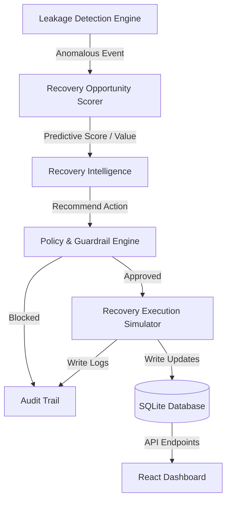

# RevenueLeak AI Consolidated Codebase

This document contains all source code and documentation files for the RevenueLeak AI application, generated for ChatGPT code review and analysis.

## Folder Structure
```text
RevenueLeak AI/
├── README.md
├── DEMO.md
├── requirements.txt
├── bundle_project.py
├── backend/
│   ├── main.py
│   ├── database.py
│   ├── ai_engine.py
│   ├── recovery_engine.py
│   └── test_recovery.py
└── frontend/
    ├── index.html
    ├── package.json
    ├── tailwind.config.js
    └── src/
        ├── App.tsx
        ├── index.css
        ├── main.tsx
        ├── pages/
        │   ├── Home.tsx
        │   ├── Login.tsx
        │   └── Dashboard.tsx
        └── components/
            ├── RevenueFlow.tsx
            ├── LeakMap.tsx
            ├── RecoveryGraph.tsx
            └── PageTransition.tsx
```

## File: `README.md`
```markdown
# RevenueLeak AI

**Find where revenue escapes. Recover what matters.**

RevenueLeak AI is a production-grade Revenue Recovery Intelligence Layer designed for digital merchants (built for the Razorpay AI Buildathon). It continuously monitors transactional anomalies, checkout drop-offs, and subscription renewal declines, calculates recovery probability using a trained machine learning model, validates recommendations against merchant guardrails, and safely simulates bounded recovery campaigns.

---

## 1. Problem & Business Context

Merchants silently lose between **5% to 15% of top-line revenue** due to friction across payment processing stages:
- **Transient Payment Failures**: Short-term bank or network timeout issues that could succeed if retried intelligently.
- **Checkout Abandonment**: Customers leaving items in their cart due to payment fatigue or UI friction.
- **Failed Subscription Renewals**: Expired cards or insufficient funds causing subscription churn.
- **Overdue Invoices**: Manual receivables remaining outstanding without proactive tracking.

### The Problem with Current Solutions
Most payment gateways treat these issues reactively, or try to retry blindly. Repeated retries lead to card brand penalties, customer annoyance, and higher fees. 

**RevenueLeak AI** solves this by acting as an **Intelligence Layer** that answers:
1. Where is the revenue leaking?
2. Which leaks have the highest business value and probability of recovery?
3. What is the optimal recovery action?
4. Is this action compliant with active policies?

---

## 2. Architecture & Decision Flow

The system follows a modular flow:



### AI Scorer Model Transparency

To calculate the recovery probability on the fly, we employ a real `scikit-learn` Machine Learning model.

#### Model Type & Appropriateness
We train a **Random Forest Classifier** (`RandomForestClassifier(n_estimators=100, max_depth=6)`). A Random Forest is ideal for this demo because:
1. It handles both categorical features (payment method, leak type) and continuous features (amount, success rates) without needing complex scaling.
2. It is highly resistant to overfitting on synthetic data and outputs well-calibrated class probabilities (`predict_proba`) which we use directly as the recovery probability.

> [!NOTE]
> This model is trained on synthetic historical transactional behavior and is designed for demo and buildathon purposes. It does not represent real-world production payment behavior.

#### Features Used
The model predicts recovery success using the following features:
- `amount` (INR value)
- `customer_success_rate` (historical success rate of the customer's transactions, from 0.0 to 1.0)
- `previous_transaction_count` (total previous transactions)
- `previous_failure_count` (total previous failures)
- `retry_count` (number of times the transaction has already failed in the current sequence)
- One-hot encoded `leak_type` (`leak_payment_failure`, `leak_checkout_abandonment`, `leak_failed_subscription`, `leak_overdue_invoice`)
- One-hot encoded `payment_method` (`pay_UPI`, `pay_card`, `pay_netbanking`, `pay_wallet`)

#### Synthetic Ground-Truth Data Generation
We train the model on 3,000 synthetic historical records generated with distinct, realistic correlation weights:
- **Leak Type Weights**: Payment processing failures have high recoverability (+0.25), whereas overdue invoices have lower recoverability (-0.15).
- **Payment Method Weights**: UPI has high baseline recoverability (+0.15), cards medium (+0.10), wallets low (+0.05), and netbanking negative (-0.05).
- **Customer Success Weight**: Up to +0.30 added depending on the customer's historical success.
- **Friction Penalties**: High amounts (₹10,000+) face a recovery penalty (-0.12); high retries decrease recovery chance (-0.08 per retry).

#### Model Evaluation
Upon initialization, the model evaluates its performance against an isolated test partition (20% split) and logs standard metrics:
- **Accuracy**: ~68%
- **ROC-AUC**: ~0.76 (indicating solid classification capability)

#### Priority Scoring Formula
We compute a transparent, explainable **Priority Score (0-100)**:
$$\text{Priority Score} = (\text{Recovery Prob.} \times 70) + \left(\frac{\min(\text{Amount}, 10000)}{10000} \times 20\right) + \left(\left(1 - \frac{\text{Retries}}{3}\right) \times 10\right)$$
- **70%**: Recovery probability from the trained Random Forest model.
- **20%**: Financial magnitude (capped at ₹10,000 to prevent outlier distortion).
- **10%**: Cooldown/Retry headroom (lower retries remaining = higher priority).


---

## 3. Tech Stack

- **Frontend**: React, TypeScript, Vite, Tailwind CSS, Lucide Icons.
- **Backend**: FastAPI, Python standard `sqlite3`, `scikit-learn` for predictive classification, `joblib` for model serialization.
- **Database**: SQLite.

---

## 4. Setup & Running Instructions

### Prerequisites
- Node.js (v18+)
- Python (v3.9+)

### Backend Setup
1. In the root directory, install python dependencies:
   ```bash
   pip install -r requirements.txt
   ```
2. Train the AI model and initialize/seed the SQLite database:
   ```bash
   python backend/database.py
   python backend/ai_engine.py
   ```
3. Run the FastAPI server:
   ```bash
   uvicorn backend.main:app --host 127.0.0.1 --port 8000 --reload
   ```
   The backend API documentation is available at `http://127.0.0.1:8000/docs`.

### Frontend Setup
1. Navigate to the `frontend/` directory and install node packages:
   ```bash
   cd frontend
   npm install
   ```
2. Start the Vite React development server:
   ```bash
   npm run dev
   ```
3. Open `http://localhost:5173` in your browser.

```

## File: `DEMO.md`
```markdown
# RevenueLeak AI - 5-Minute Pitch & Demo Script

This script walks through a structured demonstration of RevenueLeak AI, highlighting how it acts as an active Revenue Recovery Intelligence Layer.

---

## The Pitch Narrative
> "Merchants lose millions in silent revenue leaks—abandoned checkouts, temporary bank downtimes, expired subscription cards, and overdue invoices. Current systems handle this reactively: retrying transactions blindly (which damages card reputation) or ignoring them. 
> RevenueLeak AI acts as an **Intelligence Layer** that prioritizes high-value opportunities based on recovery probability using a trained AI model, checks policy guardrails, and safely simulates bounded recovery workflows."

---

## Demo Flow

### Step 1: The Command Center (Overview Page)
1. **Show the Metrics**: Point out the **Revenue At Risk** (e.g. ₹1,20,000) versus the **Revenue Recovered**.
2. **Explain the Value**: Highlight the **Est. Recoverable (AI)** value. Explain that this is not a random estimate; it is the sum of expectations computed by a Random Forest Classifier trained on merchant transaction behaviors.
3. **Audit Feed**: Show the live event logger showing that leaks are actively being ingested.

### Step 2: The Revenue Leak Map (Channel Deep-dive)
1. Navigate to the **Revenue Leak Map** tab.
2. Observe the horizontal pipeline representing the flow of transaction stages:
   `Checkout` → `Payment Processing` → `Subscriptions` → `Receivables`
3. Click on the **Payment Processing** node.
4. **Side-Sheet Analysis**: Point out the sliding pane showing:
   - **Why this leak was prioritized**: A human-readable AI explanation of the category's health.
   - **Distribution of probability**: Shows how many cases lie in high vs low recovery zones.
   - **Top affected transactions**: Direct look at the individual cases that are driving this leak.

### Step 3: Bounded Sandbox Analysis (AI Recovery Lab)
1. Navigate to the **AI Recovery Lab** tab.
2. Select a transaction ID from the dropdown list.
3. Show the **Signal Features Vector** (amount, payment method, customer success rates).
4. Click **RUN AI RECOVERY ANALYSIS**.
5. Observe the 10 sequential pipeline stages completing.
6. Look at the cards generated:
   - **AI Scorer Logic**: Shows exactly **"WHY THIS ACTION?"** (e.g., transient network error, high success history, recommending immediate retry).
   - **Guardrail Policy Checks**: Explains why the action passed or failed the merchant-defined guidelines (e.g., retry count vs max limit).
   - **Simulation Verification**: Demonstrates a seeded transaction simulation, showing the updated database status (e.g. "Recovered", "Escalated to Human", "Blocked").

### Step 4: System Guardrails (Policy & Guardrails)
1. Navigate to the **Policy & Guardrails** tab.
2. Change the **Min Confidence Threshold** to a very high level (e.g. `0.95`).
3. Click **Save Policy Configuration**.
4. Go back to the **AI Recovery Lab**, select a transaction, and run the analysis.
5. Point out how the policy engine now flags the transaction as **ACTION BLOCKED** (because the confidence of 85% is below the new 95% threshold), preserving the customer experience.

### Step 5: Large-Scale Action (Batch Simulator)
1. Click the **Batch Simulator** button in the header.
2. Choose **50 Records** and click **Execute Batch Actions**.
3. Watch the progress bar complete.
4. Show the **BEFORE vs AFTER** metrics:
   - Total recovered revenue delta (e.g., ₹25,000+ recovered instantly).
   - Number of manual support escalations.
   - Number of unsafe actions blocked by guardrails.
5. Click **Return to command center** and show how the Overview page is now fully updated, indicating a single consistent database state.

```

## File: `backend/main.py`
```python
from fastapi import FastAPI, HTTPException, Query, Body
from fastapi.middleware.cors import CORSMiddleware
from pydantic import BaseModel
import sqlite3
import math
from datetime import datetime
from typing import List, Optional
from backend.database import get_db_connection, init_db, seed_db
from backend.recovery_engine import analyze_transaction, validate_policies, process_recovery_workflow

import os

# Ensure DB is initialized and seeded
init_db()
seed_db()

app = FastAPI(title="RevenueLeak AI - API")

# Production-minded CORS configuration
CORS_ORIGINS = os.getenv(
    "CORS_ORIGINS",
    "http://localhost:5173,http://127.0.0.1:5173,http://localhost:3000,http://127.0.0.1:3000"
).split(",")

app.add_middleware(
    CORSMiddleware,
    allow_origins=CORS_ORIGINS if "*" not in CORS_ORIGINS else ["*"],
    allow_credentials=True,
    allow_methods=["*"],
    allow_headers=["*"],
)

class PolicyUpdate(BaseModel):
    max_retries: int
    min_confidence: float
    reminder_cooldown_hours: int
    high_value_threshold: float
    auto_action_enabled: bool

@app.on_event("startup")
def pre_score_unscored_transactions():
    """
    On startup, pre-score all transactions that have 0.0 recovery_probability.
    This ensures our synthetic dashboard displays correct values immediately.
    """
    print("Pre-scoring transactions using the AI model...")
    conn = get_db_connection()
    cursor = conn.cursor()
    
    cursor.execute("SELECT * FROM transactions WHERE recovery_probability = 0.0")
    rows = cursor.fetchall()
    
    if rows:
        print(f"Scoring {len(rows)} unscored transactions...")
        for row in rows:
            txn = dict(row)
            analysis = analyze_transaction(txn)
            cursor.execute("""
                UPDATE transactions
                SET recovery_probability = ?,
                    priority_score = ?,
                    expected_recovery_value = ?,
                    recommended_action = ?,
                    confidence = ?,
                    policy_status = 'pending'
                WHERE id = ?
            """, (
                analysis["recovery_probability"],
                analysis["priority_score"],
                analysis["expected_recovery_value"],
                analysis["recommended_action"],
                analysis["confidence"],
                txn["id"]
            ))
        conn.commit()
        print("Scoring complete.")
    else:
        print("All transactions already scored.")
        
    conn.close()

# ----------------- ENDPOINTS -----------------

@app.get("/api/stats")
def get_stats():
    conn = get_db_connection()
    cursor = conn.cursor()
    
    # Calculate overview stats
    cursor.execute("""
        SELECT 
            COALESCE(SUM(amount), 0) as total_at_risk,
            COUNT(*) as total_cases
        FROM transactions 
        WHERE status != 'recovered'
    """)
    at_risk_row = cursor.fetchone()
    at_risk = round(at_risk_row['total_at_risk'], 2)
    
    cursor.execute("""
        SELECT 
            COALESCE(SUM(amount), 0) as total_recovered
        FROM transactions 
        WHERE status = 'recovered'
    """)
    recovered_row = cursor.fetchone()
    recovered = round(recovered_row['total_recovered'], 2)
    
    total = recovered + at_risk
    recovery_rate = round((recovered / total * 100.0), 1) if total > 0 else 0.0
    
    # Sum of expected recovery value for unresolved cases
    cursor.execute("""
        SELECT 
            COALESCE(SUM(expected_recovery_value), 0) as total_expected
        FROM transactions
        WHERE status != 'recovered'
    """)
    expected_val = round(cursor.fetchone()['total_expected'], 2)
    
    # High Priority Leaks (top 5 unresolved)
    cursor.execute("""
        SELECT id, leak_type, amount, recovery_probability, priority_score, recommended_action, status
        FROM transactions
        WHERE status != 'recovered'
        ORDER BY priority_score DESC
        LIMIT 5
    """)
    high_priority = [dict(r) for r in cursor.fetchall()]
    
    # Minimal activity feed (last 8 audit logs)
    cursor.execute("""
        SELECT timestamp, event_type, details, transaction_id
        FROM audit_logs
        ORDER BY id DESC
        LIMIT 8
    """)
    activity = [dict(r) for r in cursor.fetchall()]
    
    conn.close()
    
    return {
        "revenue_at_risk": at_risk,
        "revenue_recovered": recovered,
        "recovery_rate": recovery_rate,
        "expected_recovery_value": expected_val,
        "high_priority_leaks": high_priority,
        "activity_feed": activity
    }

@app.get("/api/leak-map")
def get_leak_map():
    conn = get_db_connection()
    cursor = conn.cursor()
    
    leak_categories = {
        'payment_failure': 'Payment Processing',
        'checkout_abandonment': 'Checkout',
        'failed_subscription': 'Subscriptions',
        'overdue_invoice': 'Receivables'
    }
    
    results = {}
    for leak_type, display_name in leak_categories.items():
        cursor.execute("""
            SELECT 
                COALESCE(SUM(amount), 0) as at_risk,
                COALESCE(AVG(recovery_probability), 0) as avg_prob,
                COALESCE(AVG(priority_score), 0) as avg_priority,
                COALESCE(SUM(expected_recovery_value), 0) as expected_value,
                COUNT(*) as count
            FROM transactions
            WHERE leak_type = ? AND status != 'recovered'
        """, (leak_type,))
        row = cursor.fetchone()
        results[leak_type] = {
            "name": display_name,
            "amount_at_risk": round(row['at_risk'], 2),
            "recoverability": round(row['avg_prob'] * 100, 1),
            "priority_score": round(row['avg_priority'], 1),
            "expected_recovery_value": round(row['expected_value'], 2),
            "affected_cases": row['count']
        }
        
    conn.close()
    return results

@app.get("/api/leak-map/detail")
def get_leak_map_detail(leak_type: str = Query(...)):
    if leak_type not in ['payment_failure', 'checkout_abandonment', 'failed_subscription', 'overdue_invoice']:
        raise HTTPException(status_code=400, detail="Invalid leak type")
        
    conn = get_db_connection()
    cursor = conn.cursor()
    
    # 1. Why Prioritized summary
    cursor.execute("""
        SELECT 
            AVG(recovery_probability) as avg_prob,
            AVG(priority_score) as avg_priority,
            SUM(amount) as sum_amt
        FROM transactions
        WHERE leak_type = ? AND status != 'recovered'
    """, (leak_type,))
    summary = cursor.fetchone()
    avg_p = summary['avg_priority'] or 0
    avg_prob = summary['avg_prob'] or 0
    sum_amt = summary['sum_amt'] or 0
    
    why_summary = (
        f"This category exhibits a priority index of {avg_p:.1f} with average recoverability at {avg_prob:.0%}. "
        f"A total of ₹{sum_amt:,.2f} is currently outstanding, which is a prime target for automated outreach."
    )
    
    # 2. Top 5 transactions
    cursor.execute("""
        SELECT id, amount, recovery_probability, priority_score, recommended_action, status
        FROM transactions
        WHERE leak_type = ? AND status != 'recovered'
        ORDER BY priority_score DESC
        LIMIT 5
    """, (leak_type,))
    top_cases = [dict(r) for r in cursor.fetchall()]
    
    # 3. Probability distribution (buckets)
    cursor.execute("""
        SELECT recovery_probability FROM transactions 
        WHERE leak_type = ? AND status != 'recovered'
    """, (leak_type,))
    probs = [r[0] for r in cursor.fetchall()]
    
    buckets = {"0-20%": 0, "20-40%": 0, "40-60%": 0, "60-80%": 0, "80-100%": 0}
    for p in probs:
        if p < 0.2: buckets["0-20%"] += 1
        elif p < 0.4: buckets["20-40%"] += 1
        elif p < 0.6: buckets["40-60%"] += 1
        elif p < 0.8: buckets["60-80%"] += 1
        else: buckets["80-100%"] += 1
        
    # 4. Recommended strategies counts
    cursor.execute("""
        SELECT recommended_action, COUNT(*) as count 
        FROM transactions
        WHERE leak_type = ? AND status != 'recovered'
        GROUP BY recommended_action
    """, (leak_type,))
    strategies = {r['recommended_action']: r['count'] for r in cursor.fetchall()}
    
    conn.close()
    
    return {
        "why_prioritized": why_summary,
        "top_transactions": top_cases,
        "distribution": [{"bucket": k, "count": v} for k, v in buckets.items()],
        "strategies": [{"action": k.replace('_', ' ').title(), "count": v} for k, v in strategies.items()]
    }

@app.get("/api/queue")
def get_queue(
    leak_type: Optional[str] = None,
    status: Optional[str] = None,
    search: Optional[str] = None
):
    conn = get_db_connection()
    cursor = conn.cursor()
    
    query = "SELECT * FROM transactions WHERE 1=1"
    params = []
    
    if leak_type:
        query += " AND leak_type = ?"
        params.append(leak_type)
    if status:
        if status == "unresolved":
            query += " AND status != 'recovered'"
        else:
            query += " AND status = ?"
            params.append(status)
            
    if search:
        query += " AND (id LIKE ? OR customer_id LIKE ?)"
        params.append(f"%{search}%")
        params.append(f"%{search}%")
        
    query += " ORDER BY priority_score DESC"
    
    cursor.execute(query, params)
    rows = [dict(r) for r in cursor.fetchall()]
    conn.close()
    return rows

# ----------------- AI LAB STEPPER -----------------

@app.get("/api/lab/reset")
def reset_lab_transaction(txn_id: str = Query(...)):
    """
    Resets a transaction back to failed and clears retries so the user can analyze it.
    """
    conn = get_db_connection()
    cursor = conn.cursor()
    cursor.execute("""
        UPDATE transactions
        SET status = 'failed',
            retry_count = 0,
            policy_status = 'pending',
            blocked_reason = ''
        WHERE id = ?
    """, (txn_id,))
    
    # Add a reset log
    cursor.execute("""
        INSERT INTO audit_logs (transaction_id, timestamp, event_type, details)
        VALUES (?, ?, ?, ?)
    """, (txn_id, datetime.utcnow().isoformat(), "LAB_RESET", "Transaction reset in AI Lab for testing."))
    
    conn.commit()
    
    cursor.execute("SELECT * FROM transactions WHERE id = ?", (txn_id,))
    txn = dict(cursor.fetchone())
    conn.close()
    return txn

@app.get("/api/lab/analyze")
def lab_analyze(txn_id: str = Query(...)):
    """
    Step-by-step: Fetches transaction features and runs AI Scorer.
    """
    conn = get_db_connection()
    cursor = conn.cursor()
    cursor.execute("SELECT * FROM transactions WHERE id = ?", (txn_id,))
    txn_row = cursor.fetchone()
    conn.close()
    
    if not txn_row:
        raise HTTPException(status_code=404, detail="Transaction not found")
        
    txn = dict(txn_row)
    analysis = analyze_transaction(txn)
    
    return {
        "transaction": txn,
        "analysis": analysis
    }

@app.get("/api/lab/policy-check")
def lab_policy_check(txn_id: str = Query(...)):
    """
    Step-by-step: Runs Policy validation.
    """
    conn = get_db_connection()
    cursor = conn.cursor()
    
    cursor.execute("SELECT * FROM transactions WHERE id = ?", (txn_id,))
    txn = dict(cursor.fetchone())
    
    cursor.execute("SELECT * FROM policies WHERE id = 1")
    policy = dict(cursor.fetchone())
    
    conn.close()
    
    analysis = analyze_transaction(txn)
    is_approved, block_reason = validate_policies(txn, analysis, policy)
    
    return {
        "is_approved": is_approved,
        "block_reason": block_reason,
        "policy": policy,
        "analysis": analysis
    }

@app.post("/api/lab/execute")
def lab_execute(txn_id: str = Body(..., embed=True)):
    """
    Step-by-step: Executes the recovery simulator.
    """
    result = process_recovery_workflow(txn_id)
    if "error" in result:
        raise HTTPException(status_code=400, detail=result["error"])
    return result

# ----------------- POLICIES -----------------

@app.get("/api/policies")
def get_policies():
    conn = get_db_connection()
    cursor = conn.cursor()
    cursor.execute("SELECT * FROM policies WHERE id = 1")
    row = cursor.fetchone()
    
    # Get count of blocked transactions
    cursor.execute("SELECT COUNT(*) FROM transactions WHERE policy_status = 'blocked'")
    blocked_count = cursor.fetchone()[0]
    
    # Get last 5 blocked cases
    cursor.execute("""
        SELECT id, leak_type, amount, blocked_reason, last_action_time
        FROM transactions
        WHERE policy_status = 'blocked'
        ORDER BY last_action_time DESC
        LIMIT 5
    """)
    blocked_cases = [dict(r) for r in cursor.fetchall()]
    
    conn.close()
    
    policy_dict = dict(row)
    # Convert sqlite integer boolean to json boolean
    policy_dict["auto_action_enabled"] = bool(policy_dict["auto_action_enabled"])
    
    return {
        "policy": policy_dict,
        "blocked_count": blocked_count,
        "blocked_cases": blocked_cases
    }

@app.put("/api/policies")
def update_policies(update: PolicyUpdate):
    conn = get_db_connection()
    cursor = conn.cursor()
    cursor.execute("""
        UPDATE policies
        SET max_retries = ?,
            min_confidence = ?,
            reminder_cooldown_hours = ?,
            high_value_threshold = ?,
            auto_action_enabled = ?
        WHERE id = 1
    """, (
        update.max_retries,
        update.min_confidence,
        update.reminder_cooldown_hours,
        update.high_value_threshold,
        1 if update.auto_action_enabled else 0
    ))
    conn.commit()
    conn.close()
    return {"message": "Policy updated successfully"}

# ----------------- AUDIT TRAIL -----------------

@app.get("/api/audit")
def get_audit(limit: int = 100):
    conn = get_db_connection()
    cursor = conn.cursor()
    cursor.execute("""
        SELECT * FROM audit_logs
        ORDER BY id DESC
        LIMIT ?
    """, (limit,))
    rows = [dict(r) for r in cursor.fetchall()]
    conn.close()
    return rows

# ----------------- BATCH SIMULATION -----------------

@app.post("/api/batch-simulate")
def run_batch_simulate(count: int = Body(..., embed=True)):
    """
    Selects N unresolved transactions, processes them through the Recovery Engine,
    and returns a summary of the Before vs After stats.
    """
    if count not in [25, 50, 100, 250]:
        raise HTTPException(status_code=400, detail="Count must be 25, 50, 100, or 250")
        
    conn = get_db_connection()
    cursor = conn.cursor()
    
    # 1. Select N transactions deterministically (ordered by id) and record baseline
    cursor.execute("""
        SELECT id, amount, expected_recovery_value FROM transactions 
        WHERE status != 'recovered' AND status != 'stopped'
        ORDER BY id ASC
        LIMIT ?
    """, (count,))
    batch_rows = cursor.fetchall()
    txn_ids = [r[0] for r in batch_rows]
    batch_revenue_at_risk = sum(r[1] for r in batch_rows)
    batch_expected_recovery = sum(r[2] for r in batch_rows)
    
    conn.close()
    
    # 2. Run recovery workflow on each transaction in the batch
    outcomes = []
    for txn_id in txn_ids:
        res = process_recovery_workflow(txn_id)
        outcomes.append(res)
        
    # 3. Capture AFTER stats specifically for this selected batch
    conn = get_db_connection()
    cursor = conn.cursor()
    
    if txn_ids:
        placeholders = ",".join("?" for _ in txn_ids)
        cursor.execute(f"""
            SELECT id, amount, status FROM transactions 
            WHERE id IN ({placeholders})
        """, txn_ids)
        processed_txns = cursor.fetchall()
    else:
        processed_txns = []
        
    conn.close()
    
    batch_recovered_amt = sum(r[1] for r in processed_txns if r[2] == 'recovered')
    batch_recovered_cnt = sum(1 for r in processed_txns if r[2] == 'recovered')
    batch_failed_cnt = sum(1 for r in processed_txns if r[2] in ('failed_attempt', 'failed', 'unresolved'))
    batch_blocked_cnt = sum(1 for r in processed_txns if r[2] == 'blocked_by_policy')
    batch_escalated_cnt = sum(1 for r in processed_txns if r[2] == 'escalated_to_human')
    batch_recovery_rate = round((batch_recovered_amt / batch_revenue_at_risk * 100.0), 1) if batch_revenue_at_risk > 0 else 0.0
    
    return {
        "batch_size": count,
        "processed_count": len(txn_ids),
        "batch_revenue_at_risk": round(batch_revenue_at_risk, 2),
        "batch_expected_recovery": round(batch_expected_recovery, 2),
        "batch_recovered_amount": round(batch_recovered_amt, 2),
        "batch_recovered_count": batch_recovered_cnt,
        "batch_failed_count": batch_failed_cnt,
        "batch_blocked_count": batch_blocked_cnt,
        "batch_escalated_count": batch_escalated_cnt,
        "batch_recovery_rate": batch_recovery_rate,
        "before": {
            "recovered_value": 0.0,
            "recovered_count": 0,
            "recovery_rate": 0.0,
            "at_risk_value": round(batch_revenue_at_risk, 2)
        },
        "after": {
            "recovered_value": round(batch_recovered_amt, 2),
            "recovered_count": batch_recovered_cnt,
            "recovery_rate": batch_recovery_rate,
            "at_risk_value": round(max(0, batch_revenue_at_risk - batch_recovered_amt), 2)
        },
        "metrics": {
            "recovered_amount_delta": round(batch_recovered_amt, 2),
            "manual_interventions": batch_escalated_cnt,
            "blocked_actions": batch_blocked_cnt,
            "unresolved_cases": batch_failed_cnt
        },
        "outcomes": outcomes
    }

@app.post("/api/db/reset")
def reset_database():
    """
    Resets the database back to its initial seeded state with seed 42.
    """
    try:
        conn = get_db_connection()
        cursor = conn.cursor()
        
        # Clear all
        cursor.execute("DROP TABLE IF EXISTS transactions")
        cursor.execute("DROP TABLE IF EXISTS policies")
        cursor.execute("DROP TABLE IF EXISTS audit_logs")
        conn.commit()
        conn.close()
        
        # Re-initialize and seed
        init_db()
        seed_db()
        
        # Pre-score
        pre_score_unscored_transactions()
        
        return {"message": "Database reset to seeded state successfully."}
    except Exception as e:
        raise HTTPException(status_code=500, detail=f"Database reset failed: {str(e)}")


```

## File: `backend/database.py`
```python
import sqlite3
import random
from datetime import datetime, timedelta

DB_PATH = "revenue_leak.db"

def get_db_connection():
    conn = sqlite3.connect(DB_PATH)
    conn.row_factory = sqlite3.Row
    return conn

def init_db():
    conn = get_db_connection()
    cursor = conn.cursor()
    
    # Create transactions table
    cursor.execute("""
        CREATE TABLE IF NOT EXISTS transactions (
            id TEXT PRIMARY KEY,
            leak_type TEXT,
            amount REAL,
            payment_method TEXT,
            customer_id TEXT,
            customer_success_rate REAL,
            previous_transaction_count INTEGER,
            previous_failure_count INTEGER,
            status TEXT,
            failure_reason TEXT,
            retry_count INTEGER,
            last_action_time TEXT,
            recovery_probability REAL,
            priority_score REAL,
            expected_recovery_value REAL,
            recommended_action TEXT,
            confidence REAL,
            policy_status TEXT,
            blocked_reason TEXT
        )
    """)
    
    # Create policies table
    cursor.execute("""
        CREATE TABLE IF NOT EXISTS policies (
            id INTEGER PRIMARY KEY,
            max_retries INTEGER,
            min_confidence REAL,
            reminder_cooldown_hours INTEGER,
            high_value_threshold REAL,
            auto_action_enabled INTEGER
        )
    """)
    
    # Create audit_logs table
    cursor.execute("""
        CREATE TABLE IF NOT EXISTS audit_logs (
            id INTEGER PRIMARY KEY AUTOINCREMENT,
            transaction_id TEXT,
            timestamp TEXT,
            event_type TEXT,
            details TEXT
        )
    """)
    
    conn.commit()
    conn.close()

def seed_db():
    conn = get_db_connection()
    cursor = conn.cursor()
    
    # Check if we already have transactions
    cursor.execute("SELECT COUNT(*) FROM transactions")
    if cursor.fetchone()[0] > 0:
        print("Database already seeded.")
        conn.close()
        return
        
    # Clear any existing rows (just to be safe)
    cursor.execute("DELETE FROM transactions")
    cursor.execute("DELETE FROM policies")
    cursor.execute("DELETE FROM audit_logs")
    
    # Seed default policies
    cursor.execute("""
        INSERT INTO policies (id, max_retries, min_confidence, reminder_cooldown_hours, high_value_threshold, auto_action_enabled)
        VALUES (1, 2, 0.70, 24, 10000.0, 1)
    """)
    
    # Setup random state for reproducibility
    rng = random.Random(42)
    
    # Lists for synthetic generation
    leak_types = ['payment_failure', 'checkout_abandonment', 'failed_subscription', 'overdue_invoice']
    payment_methods = ['UPI', 'card', 'netbanking', 'wallet']
    
    reasons_by_leak = {
        'payment_failure': ['insufficient_funds', 'authentication_failed', 'network_timeout', 'bank_downtime'],
        'checkout_abandonment': ['cart_abandoned', 'checkout_closed', 'payment_page_exit'],
        'failed_subscription': ['card_expired', 'insufficient_funds', 'mandate_failed'],
        'overdue_invoice': ['invoice_ignored', 'disputed_amount', 'payment_delayed']
    }
    
    # Generate 600 transactions
    now = datetime.utcnow()
    transactions = []
    
    for i in range(1, 601):
        txn_id = f"TXN-{10000 + i}"
        leak_type = rng.choice(leak_types)
        
        # Generate amount in INR. Make some high value, most low/medium.
        amount_rand = rng.random()
        if amount_rand < 0.1: # 10% high value (INR 10,000 to 50,000)
            amount = round(rng.uniform(10000.0, 50000.0), 2)
        elif amount_rand < 0.4: # 30% medium-high value (INR 2,500 to 10,000)
            amount = round(rng.uniform(2500.0, 10000.0), 2)
        else: # 60% low/medium value (INR 100 to 2,500)
            amount = round(rng.uniform(100.0, 2500.0), 2)
            
        payment_method = rng.choice(payment_methods)
        customer_id = f"CUST-{rng.randint(20000, 25000)}"
        
        # Customer behavioral signals
        prev_txn = rng.randint(1, 30)
        prev_fail = rng.randint(0, min(prev_txn // 2, 8))
        success_rate = round(1.0 - (prev_fail / prev_txn), 2)
        
        # Current transaction status (starting at failed/unresolved)
        status = 'failed'
        failure_reason = rng.choice(reasons_by_leak[leak_type])
        retry_count = rng.randint(0, 1) # some start with 0 retries, some with 1
        
        # Set time between 1 and 48 hours ago
        hours_ago = rng.uniform(1.0, 48.0)
        txn_time = (now - timedelta(hours=hours_ago)).isoformat()
        
        # We leave scoring columns empty or set them to placeholder.
        # AI Scorer will score them. Let's set placeholders.
        recovery_probability = 0.0
        priority_score = 0.0
        expected_recovery_value = 0.0
        recommended_action = "none"
        confidence = 0.0
        policy_status = "pending"
        blocked_reason = ""
        
        transactions.append((
            txn_id, leak_type, amount, payment_method, customer_id, success_rate,
            prev_txn, prev_fail, status, failure_reason, retry_count, txn_time,
            recovery_probability, priority_score, expected_recovery_value,
            recommended_action, confidence, policy_status, blocked_reason
        ))
        
    cursor.executemany("""
        INSERT INTO transactions (
            id, leak_type, amount, payment_method, customer_id, customer_success_rate,
            previous_transaction_count, previous_failure_count, status, failure_reason,
            retry_count, last_action_time, recovery_probability, priority_score,
            expected_recovery_value, recommended_action, confidence, policy_status, blocked_reason
        ) VALUES (?, ?, ?, ?, ?, ?, ?, ?, ?, ?, ?, ?, ?, ?, ?, ?, ?, ?, ?)
    """, transactions)
    
    # Add initial audit logs for the database seeding
    # Let's add 5 audit logs representing recent leaks detected
    recent_txns = sorted(transactions, key=lambda x: x[11], reverse=True)[:5]
    for r_txn in recent_txns:
        cursor.execute("""
            INSERT INTO audit_logs (transaction_id, timestamp, event_type, details)
            VALUES (?, ?, ?, ?)
        """, (
            r_txn[0],
            r_txn[11],
            "LEAK_DETECTED",
            f"Revenue leak detected of type '{r_txn[1]}' for amount ₹{r_txn[2]:,.2f}. Reason: {r_txn[9]}."
        ))
        
    conn.commit()
    conn.close()
    print("Database seeded successfully with 600 synthetic records.")

if __name__ == "__main__":
    init_db()
    seed_db()

```

## File: `backend/ai_engine.py`
```python
import os
import random
import pickle
import numpy as np
import pandas as pd
from sklearn.ensemble import RandomForestClassifier
from sklearn.model_selection import train_test_split
from sklearn.metrics import accuracy_score, roc_auc_score, classification_report
import joblib

MODEL_PATH = "backend/recovery_model.joblib"

# Define mappings for encoding
LEAK_TYPES = ['payment_failure', 'checkout_abandonment', 'failed_subscription', 'overdue_invoice']
PAYMENT_METHODS = ['UPI', 'card', 'netbanking', 'wallet']

def generate_historical_data(n_samples=2500, seed=42):
    """
    Generates a synthetic historical dataset with realistic correlations.
    This simulates ground-truth merchant data where recovery events were either
    successful (1) or unsuccessful (0).
    """
    rng = random.Random(seed)
    data = []
    
    for i in range(n_samples):
        leak_type = rng.choice(LEAK_TYPES)
        payment_method = rng.choice(PAYMENT_METHODS)
        
        # Amount in INR
        amount_rand = rng.random()
        if amount_rand < 0.1:
            amount = rng.uniform(10000.0, 50000.0)
        elif amount_rand < 0.4:
            amount = rng.uniform(2500.0, 10000.0)
        else:
            amount = rng.uniform(100.0, 2500.0)
            
        # Customer behavioral stats
        prev_txn = rng.randint(1, 30)
        prev_fail = rng.randint(0, min(prev_txn // 2, 8))
        customer_success_rate = 1.0 - (prev_fail / prev_txn)
        
        retry_count = rng.randint(0, 3)
        
        # Calculate latent probability of recovery with clear correlations
        # Base probability
        prob = 0.35 
        
        # Leak type influence
        if leak_type == 'payment_failure':
            prob += 0.25
        elif leak_type == 'checkout_abandonment':
            prob += 0.10
        elif leak_type == 'failed_subscription':
            prob += 0.05
        elif leak_type == 'overdue_invoice':
            prob -= 0.15
            
        # Payment method influence
        if payment_method == 'UPI':
            prob += 0.15
        elif payment_method == 'card':
            prob += 0.10
        elif payment_method == 'wallet':
            prob += 0.05
        elif payment_method == 'netbanking':
            prob -= 0.05
            
        # Customer success history influence
        prob += 0.30 * (customer_success_rate - 0.5)
        
        # Retry count penalty (repeated retries reduce chance of recovery)
        prob -= 0.08 * retry_count
        
        # High value transaction friction
        if amount > 10000.0:
            prob -= 0.12
            
        # Add random noise
        prob += rng.normalvariate(0, 0.05)
        
        # Clip probability
        prob = max(0.02, min(0.98, prob))
        
        # Draw binary ground-truth label
        recovered = 1 if rng.random() < prob else 0
        
        data.append({
            'leak_type': leak_type,
            'payment_method': payment_method,
            'amount': amount,
            'customer_success_rate': customer_success_rate,
            'previous_transaction_count': prev_txn,
            'previous_failure_count': prev_fail,
            'retry_count': retry_count,
            'recovered': recovered
        })
        
    return pd.DataFrame(data)

def preprocess_df(df):
    """
    Applies one-hot encoding to categorical features.
    """
    # Create empty columns for one-hot representation to ensure stability
    for lt in LEAK_TYPES:
        df[f'leak_{lt}'] = (df['leak_type'] == lt).astype(int)
    for pm in PAYMENT_METHODS:
        df[f'pay_{pm}'] = (df['payment_method'] == pm).astype(int)
        
    features = [
        'amount', 'customer_success_rate', 'previous_transaction_count', 
        'previous_failure_count', 'retry_count'
    ] + [f'leak_{lt}' for lt in LEAK_TYPES] + [f'pay_{pm}' for pm in PAYMENT_METHODS]
    
    return df[features], df['recovered'] if 'recovered' in df else None

def train_ai_model():
    """
    Generates historical synthetic data, trains the classifier, logs metrics,
    and serializes the trained model.
    """
    print("Generating synthetic historical dataset for training...")
    raw_df = generate_historical_data(n_samples=3000, seed=42)
    X, y = preprocess_df(raw_df)
    
    X_train, X_test, y_train, y_test = train_test_split(X, y, test_size=0.2, random_state=42)
    
    print("Training RandomForestClassifier...")
    model = RandomForestClassifier(n_estimators=100, max_depth=6, random_state=42)
    model.fit(X_train, y_train)
    
    # Evaluate
    y_pred = model.predict(X_test)
    y_prob = model.predict_proba(X_test)[:, 1]
    
    accuracy = accuracy_score(y_test, y_pred)
    roc_auc = roc_auc_score(y_test, y_prob)
    
    print("\n=== AI Model Training Complete ===")
    print(f"Accuracy Score: {accuracy:.4f}")
    print(f"ROC-AUC Score: {roc_auc:.4f}")
    print("\nClassification Report:")
    print(classification_report(y_test, y_pred))
    print("==================================\n")
    
    # Save the model
    os.makedirs(os.path.dirname(MODEL_PATH), exist_ok=True)
    joblib.dump(model, MODEL_PATH)
    print(f"Saved trained model to {MODEL_PATH}")
    
    return model

class RecoveryScorer:
    def __init__(self):
        self.model = None
        self.load_model()
        
    def load_model(self):
        if not os.path.exists(MODEL_PATH):
            self.model = train_ai_model()
        else:
            try:
                self.model = joblib.load(MODEL_PATH)
                print(f"Loaded trained AI model from {MODEL_PATH}")
            except Exception as e:
                print(f"Error loading model: {e}. Retraining...")
                self.model = train_ai_model()
                
    def get_features_vector(self, txn_dict):
        """
        Builds a pandas DataFrame with one-hot encoded variables matching training features.
        """
        df = pd.DataFrame([txn_dict])
        X, _ = preprocess_df(df)
        return X
        
    def predict_probability(self, txn_dict):
        """
        Predicts recovery probability.
        """
        X = self.get_features_vector(txn_dict)
        prob = self.model.predict_proba(X)[0][1]
        return round(float(prob), 4)

    def calculate_priority_and_expected_value(self, amount, probability, retry_count):
        """
        Transparent priority score formula (out of 100):
        - 70% based on recovery probability
        - 20% based on financial magnitude (INR, capped at 10,000 for scaling)
        - 10% based on retries remaining (fewer retries = higher priority)
        """
        expected_value = round(amount * probability, 2)
        
        # Scaling amount: capped at 10k INR
        amount_factor = min(amount, 10000.0) / 10000.0
        
        # Retry penalty: 0 retries = 1.0, 1 retry = 0.67, 2 retries = 0.33, 3+ retries = 0.0
        retry_factor = max(0.0, 1.0 - (retry_count / 3.0))
        
        priority = (probability * 70.0) + (amount_factor * 20.0) + (retry_factor * 10.0)
        
        return round(priority, 1), expected_value

if __name__ == "__main__":
    # If run directly, train the model
    train_ai_model()

```

## File: `backend/recovery_engine.py`
```python
import sqlite3
import random
from datetime import datetime
from backend.database import get_db_connection
from backend.ai_engine import RecoveryScorer

scorer = RecoveryScorer()

def analyze_transaction(txn):
    """
    Analyzes a transaction dictionary:
    - Calls AI model to predict recovery probability.
    - Calculates priority score and expected recovery value.
    - Determines recommended recovery strategy.
    - Computes a confidence score.
    Returns analysis structured output.
    """
    amount = txn['amount']
    customer_success_rate = txn['customer_success_rate']
    previous_transaction_count = txn['previous_transaction_count']
    retry_count = txn['retry_count']
    leak_type = txn['leak_type']
    payment_method = txn['payment_method']
    failure_reason = txn['failure_reason']
    
    # Run the AI model probability prediction
    probability = scorer.predict_probability(txn)
    
    # Calculate Priority and Expected Recovery Value
    priority_score, expected_value = scorer.calculate_priority_and_expected_value(
        amount, probability, retry_count
    )
    
    # Calculate behavioral confidence score (out of 1.0)
    confidence = round(0.70 + 0.25 * customer_success_rate + (0.05 if previous_transaction_count > 10 else 0.0), 2)
    confidence = max(0.50, min(0.99, confidence)) # clamp between 50% and 99%
    
    # Determine the recommended strategy
    recommended_action = "none"
    reason_summary = ""
    
    if probability < 0.25:
        recommended_action = "stop_automated_recovery"
        reason_summary = "Recovery probability is extremely low based on past history. Stop automation to prevent customer friction."
    elif leak_type == "payment_failure":
        if failure_reason in ["insufficient_funds", "bank_downtime"]:
            if retry_count == 0:
                recommended_action = "retry_after_delay"
                reason_summary = "Temporary failure reason detected. Cooldown recommended before attempting automatic retry."
            elif retry_count == 1:
                recommended_action = "suggest_alternative_payment"
                reason_summary = "Repeated temporary failures. Recommending switching to an alternative payment method."
            else:
                recommended_action = "human_escalation"
                reason_summary = "Retry threshold exceeded for payment failure. Manual customer service intervention needed."
        elif failure_reason == "network_timeout":
            if retry_count == 0:
                recommended_action = "retry_immediately"
                reason_summary = "Transient network timeout detected. Immediate automatic retry is highly likely to succeed."
            else:
                recommended_action = "retry_after_delay"
                reason_summary = "Secondary timeout detected. Recommending retry after system cooldown."
        else: # e.g. authentication_failed
            recommended_action = "suggest_alternative_payment"
            reason_summary = "Authentication failed. Suggesting alternative payment method (e.g. UPI/Card update)."
            
    elif leak_type == "checkout_abandonment":
        if customer_success_rate > 0.8:
            recommended_action = "personalized_reminder"
            reason_summary = "Checkout abandoned by high-value customer. Personalized cart reminder is recommended."
        else:
            recommended_action = "payment_link_follow_up"
            reason_summary = "Checkout abandoned. Follow up with a direct recovery checkout link."
            
    elif leak_type == "failed_subscription":
        if failure_reason == "card_expired":
            recommended_action = "personalized_reminder"
            reason_summary = "Subscription failed due to expired card. Prompting user to update billing details."
        elif retry_count == 0:
            recommended_action = "retry_after_delay"
            reason_summary = "Subscription renewal failed. Scheduling automated retry after delay."
        else:
            recommended_action = "payment_link_follow_up"
            reason_summary = "Subscription failed repeatedly. Dispatching direct payment link to renew subscription."
            
    elif leak_type == "overdue_invoice":
        if amount > 20000.0:
            recommended_action = "human_escalation"
            reason_summary = "High-value invoice is overdue. Recommend manual sales/escalation follow-up."
        else:
            recommended_action = "payment_link_follow_up"
            reason_summary = "Invoice overdue. Re-sending structured invoice payment link."
            
    return {
        "leak_type": leak_type,
        "recovery_probability": probability,
        "priority_score": priority_score,
        "expected_recovery_value": expected_value,
        "recommended_action": recommended_action,
        "reason_summary": reason_summary,
        "confidence": confidence
    }

def validate_policies(txn, analysis, policy):
    """
    Checks policies and guardrails against transaction and recommended action.
    Returns (is_approved, block_reason)
    """
    action = analysis["recommended_action"]
    
    # If the action is to escalate to human or stop, it doesn't represent automated recovery
    if action in ["human_escalation", "stop_automated_recovery", "none"]:
        return True, ""
        
    # Check 1: Auto Action Enabled Globally
    if not policy["auto_action_enabled"]:
        return False, "Automated actions are globally disabled by merchant settings."
        
    # Check 2: Max Automatic Retries
    if action in ["retry_immediately", "retry_after_delay"]:
        if txn["retry_count"] >= policy["max_retries"]:
            return False, f"Maximum automatic retry limit ({policy['max_retries']}) exceeded."
            
    # Check 3: Minimum Decision Confidence
    if analysis["confidence"] < policy["min_confidence"]:
        return False, f"Decision confidence ({analysis['confidence']:.0%}) below policy minimum ({policy['min_confidence']:.0%})."
        
    # Check 4: High Value Threshold
    if txn["amount"] >= policy["high_value_threshold"]:
        return False, f"Transaction amount (₹{txn['amount']:,.2f}) exceeds high-value threshold (₹{policy['high_value_threshold']:,.2f}), requiring manual approval."
        
    # Check 5: Reminder Cooldown Enforcement
    if action in ["personalized_reminder", "payment_link_follow_up"] and txn.get("last_action_time"):
        try:
            last_time_str = str(txn["last_action_time"])
            if "T" in last_time_str:
                last_time = datetime.fromisoformat(last_time_str.replace("Z", ""))
            else:
                last_time = datetime.strptime(last_time_str.split(".")[0], "%Y-%m-%d %H:%M:%S")
            hours_elapsed = (datetime.utcnow() - last_time).total_seconds() / 3600.0
            cooldown_hours = policy.get("reminder_cooldown_hours", 24)
            if hours_elapsed < cooldown_hours:
                return False, f"Reminder cooldown active: {hours_elapsed:.1f}h elapsed of required {cooldown_hours}h cooldown window."
        except Exception:
            pass

    return True, ""

def process_recovery_workflow(txn_id):
    """
    Executes the full recovery orchestrator workflow:
    1. Fetches transaction.
    2. Feeds AI analysis.
    3. Runs Policy validation.
    4. Simulates execution outcome.
    5. Updates DB and inserts Audit logs.
    Returns dict representing step-by-step history and outcome.
    """
    conn = get_db_connection()
    cursor = conn.cursor()
    
    # 1. Fetch transaction
    cursor.execute("SELECT * FROM transactions WHERE id = ?", (txn_id,))
    txn_row = cursor.fetchone()
    if not txn_row:
        conn.close()
        return {"error": "Transaction not found"}
        
    txn = dict(txn_row)
    
    # Fetch active policy
    cursor.execute("SELECT * FROM policies WHERE id = 1")
    policy_row = cursor.fetchone()
    policy = dict(policy_row) if policy_row else {
        "max_retries": 2, "min_confidence": 0.70, "reminder_cooldown_hours": 24, "high_value_threshold": 10000.0, "auto_action_enabled": 1
    }
    
    steps = []
    timestamp = datetime.utcnow().isoformat()
    
    steps.append({"stage": "leak_detected", "message": f"Revenue leak of type '{txn['leak_type']}' (₹{txn['amount']:,.2f}) detected."})
    
    # 2. AI Analysis
    analysis = analyze_transaction(txn)
    steps.append({
        "stage": "ai_analyzed",
        "message": f"AI analysis completed. Probability: {analysis['recovery_probability']:.0%}, Expected Value: ₹{analysis['expected_recovery_value']:,.2f}, Priority: {analysis['priority_score']:.0f}."
    })
    steps.append({
        "stage": "strategy_selected",
        "message": f"Strategy recommended: {analysis['recommended_action'].replace('_', ' ').title()}. Reason: {analysis['reason_summary']}"
    })
    
    # 3. Policy Engine Validation
    is_approved, block_reason = validate_policies(txn, analysis, policy)
    
    status_before = txn["status"]
    new_status = txn["status"]
    new_policy_status = "approved" if is_approved else "blocked"
    new_blocked_reason = block_reason
    new_retry_count = txn["retry_count"]
    
    if not is_approved:
        steps.append({
            "stage": "policy_validated",
            "message": f"Guardrails FAILED. Action blocked: {block_reason}"
        })
        new_status = "blocked_by_policy"
        # Log policy block
        cursor.execute("""
            INSERT INTO audit_logs (transaction_id, timestamp, event_type, details)
            VALUES (?, ?, ?, ?)
        """, (txn_id, timestamp, "ACTION_BLOCKED", f"Action '{analysis['recommended_action']}' blocked by policy: {block_reason}"))
    else:
        steps.append({
            "stage": "policy_validated",
            "message": "Guardrails PASSED. Action approved."
        })
        
        # 4. Simulation Engine (Seeded using txn_id and retry_count for deterministic runs)
        # Using a deterministic seed for the simulator ensures that when the demo is re-run,
        # it gives consistent, predictable, high-quality results.
        seed_str = f"{txn_id}-{txn['retry_count']}"
        sim_rng = random.Random(seed_str)
        
        action = analysis["recommended_action"]
        outcome_rand = sim_rng.random()
        
        steps.append({
            "stage": "executing",
            "message": f"Executing recovery strategy: '{action}'..."
        })
        
        if action == "retry_immediately" or action == "retry_after_delay":
            new_retry_count += 1
            if outcome_rand < analysis["recovery_probability"]:
                new_status = "recovered"
                steps.append({
                    "stage": "completed",
                    "message": f"Recovery successful! ₹{txn['amount']:,.2f} recovered via automated retry."
                })
                cursor.execute("""
                    INSERT INTO audit_logs (transaction_id, timestamp, event_type, details)
                    VALUES (?, ?, ?, ?)
                """, (txn_id, timestamp, "RECOVERY_SUCCESS", f"Automated retry succeeded. Recovered ₹{txn['amount']:,.2f}."))
            else:
                new_status = "failed_attempt"
                steps.append({
                    "stage": "completed",
                    "message": "Recovery retry attempt failed. Transaction remains unpaid."
                })
                cursor.execute("""
                    INSERT INTO audit_logs (transaction_id, timestamp, event_type, details)
                    VALUES (?, ?, ?, ?)
                """, (txn_id, timestamp, "RECOVERY_FAILED", "Automated retry attempt failed."))
                
        elif action == "suggest_alternative_payment":
            if outcome_rand < analysis["recovery_probability"] * 0.9:
                new_status = "recovered"
                steps.append({
                    "stage": "completed",
                    "message": f"Customer responded and completed payment via alternative method. ₹{txn['amount']:,.2f} recovered."
                })
                cursor.execute("""
                    INSERT INTO audit_logs (transaction_id, timestamp, event_type, details)
                    VALUES (?, ?, ?, ?)
                """, (txn_id, timestamp, "RECOVERY_SUCCESS", f"Alternative payment successful. Recovered ₹{txn['amount']:,.2f}."))
            else:
                new_status = "failed_attempt"
                steps.append({
                    "stage": "completed",
                    "message": "Customer ignored suggestion or payment failed. Remaining at risk."
                })
                cursor.execute("""
                    INSERT INTO audit_logs (transaction_id, timestamp, event_type, details)
                    VALUES (?, ?, ?, ?)
                """, (txn_id, timestamp, "RECOVERY_FAILED", "Customer alternative payment attempt failed."))
                
        elif action in ["personalized_reminder", "payment_link_follow_up"]:
            if outcome_rand < analysis["recovery_probability"] * 0.8:
                new_status = "recovered"
                steps.append({
                    "stage": "completed",
                    "message": f"Customer clicked recovery link and completed payment. ₹{txn['amount']:,.2f} recovered."
                })
                cursor.execute("""
                    INSERT INTO audit_logs (transaction_id, timestamp, event_type, details)
                    VALUES (?, ?, ?, ?)
                """, (txn_id, timestamp, "RECOVERY_SUCCESS", f"Customer completed payment link. Recovered ₹{txn['amount']:,.2f}."))
            else:
                if outcome_rand > 0.5:
                    new_status = "ignored_by_customer"
                    steps.append({
                        "stage": "completed",
                        "message": "Customer opened recovery link/reminder but ignored it."
                    })
                    cursor.execute("""
                        INSERT INTO audit_logs (transaction_id, timestamp, event_type, details)
                        VALUES (?, ?, ?, ?)
                    """, (txn_id, timestamp, "RECOVERY_IGNORED", "Recovery link ignored by customer."))
                else:
                    new_status = "failed_attempt"
                    steps.append({
                        "stage": "completed",
                        "message": "Customer failed to complete payment via reminder link."
                    })
                    cursor.execute("""
                        INSERT INTO audit_logs (transaction_id, timestamp, event_type, details)
                        VALUES (?, ?, ?, ?)
                    """, (txn_id, timestamp, "RECOVERY_FAILED", "Reminder payment link failure."))
                    
        elif action == "human_escalation":
            new_status = "escalated_to_human"
            steps.append({
                "stage": "completed",
                "message": "Escalated to merchant operations support team for manual outreach."
            })
            cursor.execute("""
                INSERT INTO audit_logs (transaction_id, timestamp, event_type, details)
                VALUES (?, ?, ?, ?)
            """, (txn_id, timestamp, "HUMAN_ESCALATED", "Case escalated to support desk for manual handling."))
            
        elif action == "stop_automated_recovery":
            new_status = "stopped"
            steps.append({
                "stage": "completed",
                "message": "Automated recovery sequence stopped to prevent customer friction."
            })
            cursor.execute("""
                INSERT INTO audit_logs (transaction_id, timestamp, event_type, details)
                VALUES (?, ?, ?, ?)
            """, (txn_id, timestamp, "RECOVERY_STOPPED", "Automated recovery sequence stopped."))
            
    # 5. Update DB
    cursor.execute("""
        UPDATE transactions
        SET status = ?,
            retry_count = ?,
            last_action_time = ?,
            recovery_probability = ?,
            priority_score = ?,
            expected_recovery_value = ?,
            recommended_action = ?,
            confidence = ?,
            policy_status = ?,
            blocked_reason = ?
        WHERE id = ?
    """, (
        new_status, new_retry_count, timestamp,
        analysis["recovery_probability"], analysis["priority_score"],
        analysis["expected_recovery_value"], analysis["recommended_action"],
        analysis["confidence"], new_policy_status, new_blocked_reason,
        txn_id
    ))
    
    conn.commit()
    conn.close()
    
    return {
        "transaction_id": txn_id,
        "status": new_status,
        "analysis": analysis,
        "policy_status": new_policy_status,
        "blocked_reason": new_blocked_reason,
        "steps": steps
    }

```

## File: `backend/test_recovery.py`
```python
import os
import pytest
import sqlite3
from backend.database import DB_PATH, init_db, seed_db, get_db_connection
from backend.ai_engine import RecoveryScorer
from backend.recovery_engine import analyze_transaction, validate_policies, process_recovery_workflow

@pytest.fixture(scope="module", autouse=True)
def setup_test_db():
    # Make sure DB is initialized and seeded before running tests
    init_db()
    seed_db()
    yield

def test_database_seeding():
    conn = get_db_connection()
    cursor = conn.cursor()
    
    # Verify 600 transactions seeded
    cursor.execute("SELECT COUNT(*) FROM transactions")
    count = cursor.fetchone()[0]
    assert count == 600
    
    # Verify policies seeded
    cursor.execute("SELECT COUNT(*) FROM policies")
    policy_count = cursor.fetchone()[0]
    assert policy_count == 1
    
    conn.close()

def test_ai_scoring():
    scorer = RecoveryScorer()
    
    test_txn = {
        "amount": 2500.0,
        "payment_method": "UPI",
        "customer_success_rate": 0.9,
        "previous_transaction_count": 10,
        "previous_failure_count": 1,
        "retry_count": 0,
        "leak_type": "payment_failure",
        "failure_reason": "network_timeout"
    }
    
    prob = scorer.predict_probability(test_txn)
    assert 0.0 <= prob <= 1.0
    
    priority, expected_val = scorer.calculate_priority_and_expected_value(
        test_txn["amount"], prob, test_txn["retry_count"]
    )
    assert 0.0 <= priority <= 100.0
    assert expected_val == round(test_txn["amount"] * prob, 2)

def test_policy_validation():
    # Valid transaction
    test_txn = {
        "id": "TXN-TEST-1",
        "amount": 150.0,
        "retry_count": 0
    }
    
    analysis = {
        "recommended_action": "retry_immediately",
        "confidence": 0.85
    }
    
    policy = {
        "max_retries": 2,
        "min_confidence": 0.70,
        "high_value_threshold": 10000.0,
        "auto_action_enabled": 1
    }
    
    approved, reason = validate_policies(test_txn, analysis, policy)
    assert approved is True
    assert reason == ""

    # Test Blocked: Max retries exceeded
    test_txn["retry_count"] = 2
    approved, reason = validate_policies(test_txn, analysis, policy)
    assert approved is False
    assert "retry limit" in reason.lower()

    # Test Blocked: Confidence below threshold
    test_txn["retry_count"] = 0
    analysis["confidence"] = 0.50
    approved, reason = validate_policies(test_txn, analysis, policy)
    assert approved is False
    assert "confidence" in reason.lower()

    # Test Blocked: High value manual approval required
    analysis["confidence"] = 0.85
    test_txn["amount"] = 15000.0
    approved, reason = validate_policies(test_txn, analysis, policy)
    assert approved is False
    assert "exceeds high-value threshold" in reason.lower()

def test_recovery_simulation_and_audit():
    # Take a known transaction
    conn = get_db_connection()
    cursor = conn.cursor()
    cursor.execute("SELECT id FROM transactions LIMIT 1")
    txn_id = cursor.fetchone()[0]
    conn.close()

    # Process workflow
    result = process_recovery_workflow(txn_id)
    assert "status" in result
    assert "analysis" in result
    assert "steps" in result
    assert len(result["steps"]) > 0

    # Verify audit logs created
    conn = get_db_connection()
    cursor = conn.cursor()
    cursor.execute("SELECT COUNT(*) FROM audit_logs WHERE transaction_id = ?", (txn_id,))
    log_count = cursor.fetchone()[0]
    assert log_count > 0
    conn.close()

```

## File: `frontend/src/App.tsx`
```typescript
import { useState, useEffect } from "react";
import Home from "./pages/Home";
import Login from "./pages/Login";
import Dashboard from "./pages/Dashboard";
import PageTransition from "./components/PageTransition";

export default function App() {
  const [viewState, setViewState] = useState<"home" | "login" | "dashboard">("home");

  // Load auth state from localStorage on boot
  useEffect(() => {
    const token = localStorage.getItem("authToken");
    if (token === "demo-token-active-42") {
      setViewState("dashboard");
    } else {
      setViewState("home");
    }
  }, []);

  const handleEnterApp = () => {
    // Check if token exists, go directly to dashboard, else login
    const token = localStorage.getItem("authToken");
    if (token === "demo-token-active-42") {
      setViewState("dashboard");
    } else {
      setViewState("login");
    }
  };

  const handleLoginSuccess = () => {
    setViewState("dashboard");
  };

  const handleLogout = () => {
    localStorage.removeItem("authToken");
    setViewState("home");
  };

  return (
    <div className="min-h-screen bg-bgDark text-textLight selection:bg-brandBlue/30 selection:text-textLight">
      {viewState === "home" && (
        <PageTransition trigger={viewState} direction="fade">
          <Home onEnterApp={handleEnterApp} />
        </PageTransition>
      )}

      {viewState === "login" && (
        <PageTransition trigger={viewState} direction="slide-left">
          <Login onLoginSuccess={handleLoginSuccess} />
        </PageTransition>
      )}

      {viewState === "dashboard" && (
        <PageTransition trigger={viewState} direction="slide-up">
          <Dashboard onLogout={handleLogout} />
        </PageTransition>
      )}
    </div>
  );
}

```

## File: `frontend/src/pages/Home.tsx`
```typescript
import { useEffect, useState, useRef } from "react";
import {
  ArrowRight,
  Shield,
  Activity,
  CheckCircle2,
  AlertTriangle,
  Zap,
  Lock,
  RefreshCcw,
  Sparkles
} from "lucide-react";

interface HomeProps {
  onEnterApp: () => void;
}

export default function Home({ onEnterApp }: HomeProps) {
  const [scrollPct, setScrollPct] = useState<number>(0);
  const [activeStage, setActiveStage] = useState<number>(0);
  const containerRef = useRef<HTMLDivElement>(null);

  // Track scroll position continuously for smooth scroll-driven interpolation (0.0 to 1.0)
  useEffect(() => {
    let animationFrameId: number;

    const handleScroll = () => {
      if (!containerRef.current) return;
      const rect = containerRef.current.getBoundingClientRect();
      const totalScrollable = rect.height - window.innerHeight;
      const currentScrolled = -rect.top;

      if (totalScrollable <= 0) return;
      const pct = Math.max(0, Math.min(1, currentScrolled / totalScrollable));
      setScrollPct(pct);

      // Compute discrete active stage (0 to 5) for text focus
      const stageIndex = Math.min(5, Math.floor(pct * 6));
      setActiveStage(stageIndex);
    };

    const onScroll = () => {
      animationFrameId = requestAnimationFrame(handleScroll);
    };

    window.addEventListener("scroll", onScroll, { passive: true });
    handleScroll();

    return () => {
      window.removeEventListener("scroll", onScroll);
      if (animationFrameId) cancelAnimationFrame(animationFrameId);
    };
  }, []);

  const stagesList = [
    { id: 0, tag: "01", title: "HEALTHY FLOW" },
    { id: 1, tag: "02", title: "LEAKAGE" },
    { id: 2, tag: "03", title: "AI DETECTION" },
    { id: 3, tag: "04", title: "DECISION" },
    { id: 4, tag: "05", tagTitle: "VALIDATION", title: "GUARDRAILS" },
    { id: 5, tag: "06", title: "RECOVERY" },
  ];

  // Helper to compute continuous opacity for section cards based on scroll pct
  const getSectionOpacity = (stageIdx: number) => {
    const targetPct = stageIdx / 5;
    const distance = Math.abs(scrollPct - targetPct);
    return Math.max(0.15, 1 - distance * 4.5);
  };

  const getSectionTransform = (stageIdx: number) => {
    const targetPct = stageIdx / 5;
    const diff = scrollPct - targetPct;
    const translateY = diff * 80;
    return `translateY(${translateY}px)`;
  };

  return (
    <div ref={containerRef} className="relative bg-bgDark min-h-[500vh] text-textLight font-sans selection:bg-brandBlue/30 selection:text-white">
      {/* Sticky Top Header Bar */}
      <nav className="fixed top-0 inset-x-0 h-16 border-b border-borderDark/80 bg-bgDark/90 backdrop-blur-md z-40 px-6 lg:px-12 flex items-center justify-between">
        <div className="flex items-center space-x-3">
          <div className="w-8 h-8 rounded-lg bg-brandBlue flex items-center justify-center font-black text-white shadow-md shadow-brandBlue/20">
            R
          </div>
          <div>
            <span className="text-sm font-black tracking-tight uppercase text-white">REVENUELEAK AI</span>
            <span className="hidden sm:inline-block ml-2 text-[10px] bg-brandBlue/15 text-brandBlue border border-brandBlue/30 px-2 py-0.5 rounded font-mono font-bold">
              BUILDATHON MVP
            </span>
          </div>
        </div>

        <div className="flex items-center space-x-4">
          <button
            onClick={onEnterApp}
            className="bg-brandBlue hover:bg-brandBlueHover text-white px-5 py-2 rounded-lg text-xs font-bold tracking-wider uppercase transition-all duration-200 shadow-md shadow-brandBlue/20 flex items-center space-x-2"
          >
            <span>Enter Application</span>
            <ArrowRight className="w-3.5 h-3.5" />
          </button>
        </div>
      </nav>

      {/* Right Column: Sticky Scroll-Responsive Visual System */}
      <div className="sticky top-16 right-0 h-[calc(100vh-4rem)] w-full lg:w-[52%] float-right flex items-center justify-center p-4 sm:p-6 lg:p-10 z-20 overflow-hidden">
        <div className="w-full max-w-xl bg-bgCard/95 border border-borderDark rounded-xl p-6 lg:p-8 relative shadow-2xl backdrop-blur-xl flex flex-col justify-between h-[520px]">
          
          {/* Header indicator */}
          <div className="flex justify-between items-center border-b border-zinc-900 pb-3">
            <div className="flex items-center space-x-2 text-[11px] font-bold text-brandBlue uppercase tracking-wider">
              <Activity className="w-4 h-4 text-brandBlue" />
              <span>Revenue Intelligence Flow Engine</span>
            </div>
            <div className="flex items-center space-x-1.5">
              <span className="text-[10px] text-textMuted font-mono font-bold">STAGE 0{activeStage + 1} / 06</span>
            </div>
          </div>

          {/* Canvas: Dynamically rendered based on exact scroll percentage */}
          <div className="relative flex-1 flex items-center justify-center my-2">
            <svg className="w-full h-full max-h-[340px]" viewBox="0 0 540 340" fill="none" xmlns="http://www.w3.org/2000/svg">
              <defs>
                <linearGradient id="healthy-grad" x1="0%" y1="0%" x2="100%" y2="0%">
                  <stop offset="0%" stopColor="#2563EB" stopOpacity="0.9" />
                  <stop offset="100%" stopColor="#3B82F6" stopOpacity="0.5" />
                </linearGradient>
                <linearGradient id="leak-grad" x1="0%" y1="0%" x2="100%" y2="100%">
                  <stop offset="0%" stopColor="#2563EB" stopOpacity="0.5" />
                  <stop offset="100%" stopColor="#EF4444" stopOpacity="0.9" />
                </linearGradient>
                <linearGradient id="recovery-grad" x1="0%" y1="0%" x2="100%" y2="0%">
                  <stop offset="0%" stopColor="#EF4444" stopOpacity="0.6" />
                  <stop offset="50%" stopColor="#F59E0B" stopOpacity="0.8" />
                  <stop offset="100%" stopColor="#10B981" stopOpacity="1" />
                </linearGradient>
              </defs>

              {/* Base Line */}
              <line x1="40" y1="170" x2="500" y2="170" stroke="#1F2328" strokeWidth="2" strokeDasharray="4 4" />
              
              {/* STATE 0: Healthy Flow */}
              <path
                d="M 40 170 Q 180 170, 270 170 T 500 170"
                stroke={activeStage >= 5 ? "#10B981" : "url(#healthy-grad)"}
                strokeWidth={activeStage === 0 ? "5" : "3.5"}
                fill="none"
                style={{ transition: "stroke 0.4s ease, stroke-width 0.4s ease" }}
              />

              {/* Main Stream Intake Node */}
              <circle cx="40" cy="170" r="12" fill="#0B0C0E" stroke="#2563EB" strokeWidth="3" />
              <circle cx="40" cy="170" r="5" fill="#2563EB" />
              <text x="40" y="198" fill="#8A94A6" fontSize="9" textAnchor="middle" fontWeight="bold font-mono">GROSS INTAKE</text>

              {/* STATE 1: Leakage Branch (Reveals smoothly when scrollPct >= 0.16) */}
              <g style={{ opacity: Math.min(1, Math.max(0, (scrollPct - 0.12) * 6)), transition: "opacity 0.3s ease" }}>
                <path
                  d="M 180 170 Q 230 170, 270 240 T 360 260"
                  stroke="url(#leak-grad)"
                  strokeWidth="3.5"
                  fill="none"
                />
                <circle cx="360" cy="260" r="16" fill="#0B0C0E" stroke="#EF4444" strokeWidth="2.5" />
                <circle cx="360" cy="260" r="6" fill="#EF4444" />
                <rect x="300" y="290" width="120" height="24" rx="4" fill="#180C0E" stroke="#EF4444" strokeWidth="1" />
                <text x="360" y="306" fill="#EF4444" fontSize="10" textAnchor="middle" fontWeight="bold" fontFamily="monospace">
                  ₹45,000 LEAKED
                </text>
              </g>

              {/* STATE 2: AI Detection Scanner (Reveals smoothly when scrollPct >= 0.32) */}
              <g style={{ opacity: Math.min(1, Math.max(0, (scrollPct - 0.30) * 6)), transition: "opacity 0.3s ease" }}>
                <circle cx="360" cy="260" r="34" fill="none" stroke="#F59E0B" strokeWidth="1.5" strokeDasharray="6 6" />
                <line x1="270" y1="70" x2="360" y2="260" stroke="#F59E0B" strokeWidth="1.5" strokeDasharray="4 4" />
                <circle cx="270" cy="70" r="14" fill="#0B0C0E" stroke="#F59E0B" strokeWidth="3" />
                <circle cx="270" cy="70" r="5" fill="#F59E0B" />
                <text x="270" y="48" fill="#F59E0B" fontSize="10" textAnchor="middle" fontWeight="bold">AI SCORER</text>

                <g transform="translate(60, 40)">
                  <rect x="0" y="0" width="160" height="82" rx="6" fill="#131518" stroke="#1F2328" strokeWidth="1.5" />
                  <text x="12" y="20" fill="#8A94A6" fontSize="8" fontWeight="bold">TELEMETRY SCORES</text>
                  <text x="12" y="38" fill="#F3F4F6" fontSize="10" fontWeight="bold">At Risk: ₹45,000</text>
                  <text x="12" y="54" fill="#10B981" fontSize="10" fontWeight="bold">Recoverability: 87%</text>
                  <text x="12" y="70" fill="#F59E0B" fontSize="10" fontWeight="bold">Priority Score: 94 / 100</text>
                </g>
              </g>

              {/* STATE 3: Decision Orchestrator (Reveals when scrollPct >= 0.50) */}
              <g style={{ opacity: Math.min(1, Math.max(0, (scrollPct - 0.48) * 6)), transition: "opacity 0.3s ease" }}>
                <rect x="230" y="140" width="80" height="60" rx="6" fill="#0B0C0E" stroke="#3B82F6" strokeWidth="2" />
                <text x="270" y="163" fill="#60A5FA" fontSize="9" textAnchor="middle" fontWeight="bold">ORCHESTRATOR</text>
                <text x="270" y="180" fill="#10B981" fontSize="8" textAnchor="middle" fontWeight="semibold">RETRY_DELAY</text>
              </g>

              {/* STATE 4: Policy Guardrails (Reveals when scrollPct >= 0.68) */}
              <g style={{ opacity: Math.min(1, Math.max(0, (scrollPct - 0.65) * 6)), transition: "opacity 0.3s ease" }}>
                <rect x="350" y="125" width="130" height="90" rx="6" fill="#0B0C0E" stroke="#10B981" strokeWidth="1.5" />
                <text x="415" y="145" fill="#10B981" fontSize="9" textAnchor="middle" fontWeight="bold">MERCHANT GUARDRAILS</text>
                <text x="362" y="165" fill="#8A94A6" fontSize="8">Max Retries: 1/2</text>
                <text x="455" y="165" fill="#10B981" fontSize="8" fontWeight="bold">✓ PASS</text>
                <text x="362" y="180" fill="#8A94A6" fontSize="8">Min Conf: 91%/70%</text>
                <text x="455" y="180" fill="#10B981" fontSize="8" fontWeight="bold">✓ PASS</text>
                <text x="362" y="195" fill="#8A94A6" fontSize="8">High Value Limit</text>
                <text x="455" y="195" fill="#10B981" fontSize="8" fontWeight="bold">✓ PASS</text>
              </g>

              {/* STATE 5: Recovery Reconnection (Reveals when scrollPct >= 0.84) */}
              <g style={{ opacity: Math.min(1, Math.max(0, (scrollPct - 0.82) * 6)), transition: "opacity 0.3s ease" }}>
                <path
                  d="M 360 260 Q 420 260, 460 200 T 500 170"
                  stroke="url(#recovery-grad)"
                  strokeWidth="4"
                  fill="none"
                />
                <circle cx="500" cy="170" r="14" fill="#0B0C0E" stroke="#10B981" strokeWidth="3" />
                <circle cx="500" cy="170" r="6" fill="#10B981" />
                <text x="500" y="198" fill="#10B981" fontSize="9" textAnchor="middle" fontWeight="bold font-mono">RECOVERED</text>
              </g>
            </svg>
          </div>

          {/* Connected Stage Indicators */}
          <div className="grid grid-cols-6 gap-1.5 pt-3 border-t border-zinc-900">
            {stagesList.map((stg) => {
              const isActive = activeStage === stg.id;
              const isPassed = activeStage > stg.id;
              return (
                <div
                  key={stg.id}
                  className={`py-2 px-1 text-center rounded transition-all duration-300 ${
                    isActive
                      ? "bg-brandBlue text-white border border-brandBlue shadow-md shadow-brandBlue/30 font-bold"
                      : isPassed
                      ? "bg-emerald-950/30 text-brandGreen border border-emerald-800/40 font-semibold"
                      : "bg-zinc-950 text-zinc-600 border border-transparent"
                  }`}
                >
                  <p className="text-[8px] font-mono uppercase">STATE {stg.tag}</p>
                  <p className="text-[9px] truncate">{stg.title}</p>
                </div>
              );
            })}
          </div>

        </div>
      </div>

      {/* Left Column: Scroll-interpolated Storytelling Sections */}
      <div className="w-full lg:w-[48%] px-6 sm:px-12 lg:px-20 flex flex-col justify-start relative z-30 pt-16">
        
        {/* STATE 01 — HEALTHY FLOW */}
        <section
          style={{ opacity: getSectionOpacity(0), transform: getSectionTransform(0) }}
          className="h-[80vh] flex flex-col justify-center max-w-lg space-y-6 transition-all duration-300"
        >
          <div className="inline-flex items-center space-x-2 bg-brandBlue/10 border border-brandBlue/30 px-3 py-1 rounded-full text-xs font-bold text-brandBlue uppercase tracking-widest">
            <Sparkles className="w-3.5 h-3.5 text-brandBlue" />
            <span>State 01 / Baseline Stream</span>
          </div>

          <h1 className="text-4xl lg:text-6xl font-black tracking-tight leading-tight">
            Revenue isn't just lost. <br />
            <span className="text-brandRed">It leaks silently.</span>
          </h1>

          <p className="text-sm lg:text-base text-textMuted leading-relaxed">
            Every digital operation experiences payment drop-offs. RevenueLeak AI identifies where money gets stuck, scores recoverability using machine learning, and safely automates recovery workflows.
          </p>

          <div className="pt-4 flex items-center space-x-4">
            <button
              onClick={onEnterApp}
              className="bg-brandBlue hover:bg-brandBlueHover text-white px-7 py-3.5 rounded-lg text-xs font-bold tracking-wider uppercase transition-all duration-200 shadow-lg shadow-brandBlue/20 flex items-center space-x-2"
            >
              <span>Enter Application</span>
              <ArrowRight className="w-4 h-4" />
            </button>
          </div>
        </section>

        {/* STATE 02 — LEAKAGE */}
        <section
          style={{ opacity: getSectionOpacity(1), transform: getSectionTransform(1) }}
          className="h-[80vh] flex flex-col justify-center max-w-lg space-y-6 transition-all duration-300"
        >
          <div className="inline-flex items-center space-x-2 bg-rose-950/40 border border-rose-900/60 px-3 py-1 rounded-full text-xs font-bold text-brandRed uppercase tracking-widest">
            <AlertTriangle className="w-3.5 h-3.5 text-brandRed" />
            <span>State 02 / Friction Points</span>
          </div>

          <h2 className="text-3xl lg:text-4xl font-extrabold tracking-tight">The Silent Leaks</h2>
          <p className="text-sm lg:text-base text-textMuted leading-relaxed">
            Bank downtimes, expired mandates, payment gateway timeouts, and abandoned checkouts quietly siphon away up to 15% of ARR without real-time detection.
          </p>

          <div className="bg-zinc-950 p-5 border border-zinc-900 rounded-xl space-y-3">
            <div className="flex justify-between items-center border-b border-zinc-900 pb-2 text-xs">
              <span className="text-textMuted">Failed Card Retries</span>
              <span className="font-bold text-brandRed font-mono">₹35,000 at risk</span>
            </div>
            <div className="flex justify-between items-center border-b border-zinc-900 pb-2 text-xs">
              <span className="text-textMuted">Checkout Abandonments</span>
              <span className="font-bold text-brandRed font-mono">₹28,000 at risk</span>
            </div>
            <div className="flex justify-between items-center text-xs">
              <span className="text-textMuted">Subscription Mandate Failures</span>
              <span className="font-bold text-brandRed font-mono">₹32,000 at risk</span>
            </div>
          </div>
        </section>

        {/* STATE 03 — AI DETECTION */}
        <section
          style={{ opacity: getSectionOpacity(2), transform: getSectionTransform(2) }}
          className="h-[80vh] flex flex-col justify-center max-w-lg space-y-6 transition-all duration-300"
        >
          <div className="inline-flex items-center space-x-2 bg-amber-950/40 border border-amber-800/60 px-3 py-1 rounded-full text-xs font-bold text-brandYellow uppercase tracking-widest">
            <Zap className="w-3.5 h-3.5 text-brandYellow" />
            <span>State 03 / Predictive Scoring</span>
          </div>

          <h2 className="text-3xl lg:text-4xl font-extrabold tracking-tight">Trained ML Intelligence</h2>
          <p className="text-sm lg:text-base text-textMuted leading-relaxed">
            Our custom Random Forest model analyzes payment method success rates, customer transaction history, and retry counts to calculate expected recovery values instantly.
          </p>

          <div className="grid grid-cols-2 gap-4 text-center">
            <div className="bg-bgCard border border-borderDark p-4 rounded-xl">
              <p className="text-[10px] text-textMuted uppercase font-bold tracking-wider font-mono">Recoverability</p>
              <h4 className="text-3xl font-black text-brandGreen mt-1 font-mono">87%</h4>
            </div>
            <div className="bg-bgCard border border-borderDark p-4 rounded-xl">
              <p className="text-[10px] text-textMuted uppercase font-bold tracking-wider font-mono">Priority Index</p>
              <h4 className="text-3xl font-black text-brandYellow mt-1 font-mono">94 / 100</h4>
            </div>
          </div>
        </section>

        {/* STATE 04 — DECISION */}
        <section
          style={{ opacity: getSectionOpacity(3), transform: getSectionTransform(3) }}
          className="h-[80vh] flex flex-col justify-center max-w-lg space-y-6 transition-all duration-300"
        >
          <div className="inline-flex items-center space-x-2 bg-brandBlue/10 border border-brandBlue/30 px-3 py-1 rounded-full text-xs font-bold text-brandBlue uppercase tracking-widest">
            <RefreshCcw className="w-3.5 h-3.5 text-brandBlue" />
            <span>State 04 / Strategy Selection</span>
          </div>

          <h2 className="text-3xl lg:text-4xl font-extrabold tracking-tight">Adaptive Strategy Selection</h2>
          <p className="text-sm lg:text-base text-textMuted leading-relaxed">
            The orchestrator selects the exact optimal strategy—whether scheduling delayed retries, sending personalized payment links, or escalating high-value cases to human support.
          </p>

          <div className="bg-zinc-950 p-4 border border-zinc-900 rounded-xl text-xs space-y-2 font-mono">
            <div className="flex justify-between items-center">
              <span className="text-textMuted">Network Timeout</span>
              <span className="font-bold text-brandBlue">RETRY_IMMEDIATELY</span>
            </div>
            <div className="flex justify-between items-center">
              <span className="text-textMuted">Overdue Invoice</span>
              <span className="font-bold text-brandYellow">HUMAN_ESCALATION</span>
            </div>
          </div>
        </section>

        {/* STATE 05 — POLICY VALIDATION */}
        <section
          style={{ opacity: getSectionOpacity(4), transform: getSectionTransform(4) }}
          className="h-[80vh] flex flex-col justify-center max-w-lg space-y-6 transition-all duration-300"
        >
          <div className="inline-flex items-center space-x-2 bg-emerald-950/40 border border-emerald-800/60 px-3 py-1 rounded-full text-xs font-bold text-brandGreen uppercase tracking-widest">
            <Shield className="w-3.5 h-3.5 text-brandGreen" />
            <span>State 05 / Guardrail Layer</span>
          </div>

          <h2 className="text-3xl lg:text-4xl font-extrabold tracking-tight">Trust & Guardrail Protection</h2>
          <p className="text-sm lg:text-base text-textMuted leading-relaxed">
            AI proposes, but merchant rules govern. Every action must validate against retry limits, confidence floors, and high-value approval thresholds before executing.
          </p>

          <div className="flex items-center space-x-3 text-xs bg-zinc-950 p-4 border border-zinc-900 rounded-xl">
            <Lock className="w-5 h-5 text-brandGreen flex-shrink-0" />
            <span className="text-textMuted leading-relaxed">
              Automatic validation prevents customer spam, guarantees policy compliance, and keeps brand trust 100% secure.
            </span>
          </div>
        </section>

        {/* STATE 06 — RECOVERY */}
        <section
          style={{ opacity: getSectionOpacity(5), transform: getSectionTransform(5) }}
          className="h-[80vh] flex flex-col justify-center max-w-lg space-y-6 transition-all duration-300 pb-20"
        >
          <div className="inline-flex items-center space-x-2 bg-emerald-950/40 border border-emerald-800/60 px-3 py-1 rounded-full text-xs font-bold text-brandGreen uppercase tracking-widest">
            <CheckCircle2 className="w-3.5 h-3.5 text-brandGreen" />
            <span>State 06 / Autonomous Recovery</span>
          </div>

          <h2 className="text-4xl lg:text-5xl font-black tracking-tight">Recover what matters.</h2>
          <p className="text-sm lg:text-base text-textMuted leading-relaxed">
            Leaked revenue re-enters your gross ledger safely. Launch the Revenue Intelligence Command Center now.
          </p>

          <button
            onClick={onEnterApp}
            className="w-full sm:w-auto bg-brandBlue hover:bg-brandBlueHover text-white px-8 py-4 rounded-lg font-bold text-xs tracking-wider transition-all duration-200 uppercase flex items-center justify-center space-x-2 shadow-xl shadow-brandBlue/30"
          >
            <span>ENTER REVENUELEAK AI</span>
            <ArrowRight className="w-4 h-4" />
          </button>
        </section>

      </div>
    </div>
  );
}

```

## File: `frontend/src/pages/Login.tsx`
```typescript
import { useState } from "react";
import { Shield, ArrowRight, Activity, Zap } from "lucide-react";

interface LoginProps {
  onLoginSuccess: () => void;
}

export default function Login({ onLoginSuccess }: LoginProps) {
  const [email, setEmail] = useState("");
  const [password, setPassword] = useState("");
  const [loading, setLoading] = useState(false);
  const [error, setError] = useState("");

  const handleLogin = (e: React.FormEvent) => {
    e.preventDefault();
    setLoading(true);
    setError("");

    setTimeout(() => {
      if (email === "admin@revenueleak.ai" && password === "admin123") {
        localStorage.setItem("authToken", "demo-token-active-42");
        onLoginSuccess();
      } else {
        setError("Invalid credentials. Hint: use the 'Bypass & Demo Access' button.");
        setLoading(false);
      }
    }, 600);
  };

  const handleDemoAccess = () => {
    setLoading(true);
    setTimeout(() => {
      localStorage.setItem("authToken", "demo-token-active-42");
      onLoginSuccess();
    }, 350);
  };

  return (
    <div className="min-h-screen bg-bgDark flex flex-col md:flex-row items-stretch select-none font-sans text-textLight">
      {/* Left Column: Authentic B2B Fintech Login Form */}
      <div className="w-full md:w-[46%] border-r border-borderDark bg-bgCard/40 flex flex-col justify-between p-8 lg:p-14 z-20">
        {/* Branding header */}
        <div className="flex items-center space-x-3">
          <div className="w-9 h-9 rounded-lg bg-brandBlue flex items-center justify-center font-black text-xl text-white shadow-lg shadow-brandBlue/30">
            R
          </div>
          <div>
            <h1 className="text-base font-black tracking-tight uppercase text-white">REVENUELEAK AI</h1>
            <p className="text-[10px] text-textMuted uppercase font-mono tracking-wider">Revenue Intelligence Engine</p>
          </div>
        </div>

        {/* Credentials Form */}
        <div className="max-w-sm w-full mx-auto space-y-6 py-10">
          <div className="space-y-2">
            <h2 className="text-2xl lg:text-3xl font-black tracking-tight text-white">Command Center</h2>
            <p className="text-xs text-textMuted leading-relaxed">
              Sign in to monitor real-time leakage funnels, configure merchant safety guardrails, and execute AI recovery actions.
            </p>
          </div>

          <form onSubmit={handleLogin} className="space-y-4 pt-2">
            {error && (
              <div className="bg-rose-950/40 text-brandRed border border-rose-900/60 p-3 rounded-lg text-xs font-semibold animate-fadeIn">
                {error}
              </div>
            )}

            <div>
              <label className="block text-[10px] font-bold text-textMuted uppercase tracking-wider mb-2">Merchant Email</label>
              <input
                type="email"
                required
                value={email}
                onChange={(e) => setEmail(e.target.value)}
                placeholder="admin@revenueleak.ai"
                className="w-full bg-zinc-950 border border-zinc-800 rounded-lg px-3.5 py-3 text-xs text-textLight focus:outline-none focus:ring-1 focus:ring-brandBlue focus:border-brandBlue transition"
              />
            </div>

            <div>
              <label className="block text-[10px] font-bold text-textMuted uppercase tracking-wider mb-2">Password</label>
              <input
                type="password"
                required
                value={password}
                onChange={(e) => setPassword(e.target.value)}
                placeholder="••••••••"
                className="w-full bg-zinc-950 border border-zinc-800 rounded-lg px-3.5 py-3 text-xs text-textLight focus:outline-none focus:ring-1 focus:ring-brandBlue focus:border-brandBlue transition"
              />
            </div>

            <button
              type="submit"
              disabled={loading}
              className="w-full py-3.5 bg-brandBlue hover:bg-brandBlueHover text-white font-bold text-xs tracking-wider transition-all duration-200 rounded-lg uppercase flex items-center justify-center space-x-2 shadow-lg shadow-brandBlue/20"
            >
              <span>{loading ? "Authenticating Session..." : "Sign In to Platform"}</span>
              <ArrowRight className="w-3.5 h-3.5" />
            </button>
          </form>

          <div className="relative flex py-2 items-center">
            <div className="flex-grow border-t border-zinc-800"></div>
            <span className="flex-shrink mx-4 text-[9px] font-bold text-zinc-500 uppercase tracking-widest font-mono">Buildathon Quick Pass</span>
            <div className="flex-grow border-t border-zinc-800"></div>
          </div>

          <button
            onClick={handleDemoAccess}
            disabled={loading}
            className="w-full py-3.5 bg-zinc-900 hover:bg-zinc-800 text-brandBlue hover:text-white border border-zinc-800 hover:border-brandBlue/50 rounded-lg font-bold text-xs tracking-wider transition-all uppercase flex items-center justify-center space-x-2"
          >
            <Zap className="w-3.5 h-3.5 text-brandBlue" />
            <span>Bypass & Demo Access</span>
          </button>
        </div>

        {/* Footer info */}
        <div className="flex items-center space-x-2 text-[10px] text-zinc-500 font-mono">
          <Shield className="w-3.5 h-3.5 text-brandBlue" />
          <span>Local Developer Sandbox Environment • SQLite 3 & FastAPI</span>
        </div>
      </div>

      {/* Right Column: Connected Revenue Intelligence Visualization */}
      <div className="hidden md:flex flex-1 items-center justify-center p-12 bg-bgDark relative overflow-hidden">
        {/* Subtle grid pattern */}
        <div className="absolute inset-0 bg-[linear-gradient(to_right,#131518_1px,transparent_1px),linear-gradient(to_bottom,#131518_1px,transparent_1px)] bg-[size:3.5rem_3.5rem] opacity-60"></div>

        <div className="relative z-10 w-full max-w-lg bg-bgCard/90 border border-borderDark/80 rounded-xl p-8 space-y-6 shadow-2xl backdrop-blur-md">
          <div className="flex justify-between items-center border-b border-zinc-900/80 pb-3">
            <div className="flex items-center space-x-2">
              <Activity className="w-4 h-4 text-brandBlue animate-pulse" />
              <span className="text-[11px] font-bold uppercase tracking-wider text-textLight">Live Revenue Telemetry</span>
            </div>
            <span className="px-2 py-0.5 rounded text-[9px] font-mono font-bold bg-emerald-950/40 text-brandGreen border border-emerald-800/40">
              ORCHESTRATOR ONLINE
            </span>
          </div>

          {/* SVG Animated Flow Canvas */}
          <svg className="w-full h-64" viewBox="0 0 440 240" fill="none" xmlns="http://www.w3.org/2000/svg">
            <defs>
              <linearGradient id="login-flow-1" x1="0%" y1="0%" x2="100%" y2="0%">
                <stop offset="0%" stopColor="#2563EB" stopOpacity="0.8" />
                <stop offset="100%" stopColor="#10B981" stopOpacity="0.8" />
              </linearGradient>
            </defs>

            {/* Connecting paths */}
            <path d="M 60 120 C 140 120, 140 50, 220 50 C 300 50, 300 120, 380 120" stroke="#1F2328" strokeWidth="2.5" fill="none" />
            <path d="M 60 120 C 140 120, 140 190, 220 190 C 300 190, 300 120, 380 120" stroke="#1F2328" strokeWidth="2.5" fill="none" />

            {/* Animated Stream Lines */}
            <path d="M 60 120 C 140 120, 140 50, 220 50 C 300 50, 300 120, 380 120" stroke="url(#login-flow-1)" strokeWidth="2" strokeDasharray="10 30" className="flow-animate-once" fill="none" />
            <path d="M 60 120 C 140 120, 140 190, 220 190 C 300 190, 300 120, 380 120" stroke="#EF4444" strokeWidth="2" strokeDasharray="10 35" className="flow-animate-once" fill="none" />

            {/* Node Dots */}
            <circle cx="60" cy="120" r="10" fill="#0B0C0E" stroke="#2563EB" strokeWidth="2.5" />
            <circle cx="60" cy="120" r="4" fill="#2563EB" />

            <circle cx="220" cy="50" r="12" fill="#0B0C0E" stroke="#10B981" strokeWidth="2.5" />
            <circle cx="220" cy="50" r="5" fill="#10B981" />

            <circle cx="220" cy="190" r="12" fill="#0B0C0E" stroke="#EF4444" strokeWidth="2.5" />
            <circle cx="220" cy="190" r="5" fill="#EF4444" />

            <circle cx="380" cy="120" r="12" fill="#0B0C0E" stroke="#10B981" strokeWidth="3" />
            <circle cx="380" cy="120" r="5" fill="#10B981" />

            {/* Labels */}
            <text x="60" y="146" fill="#8A94A6" fontSize="9" textAnchor="middle" fontWeight="bold">INTAKE</text>
            <text x="220" y="32" fill="#10B981" fontSize="9" textAnchor="middle" fontWeight="bold">RECOVERED</text>
            <text x="220" y="218" fill="#EF4444" fontSize="9" textAnchor="middle" fontWeight="bold">LEAKAGE</text>
            <text x="380" y="146" fill="#10B981" fontSize="9" textAnchor="middle" fontWeight="bold">GROSS NET</text>
          </svg>

          {/* Model specs box */}
          <div className="bg-zinc-950 p-4 rounded-lg border border-zinc-900 flex items-center justify-between text-xs">
            <div>
              <span className="block text-[10px] text-textMuted uppercase font-mono">Trained Model</span>
              <span className="font-bold text-textLight font-mono">RandomForest(max_depth=6)</span>
            </div>
            <div className="text-right">
              <span className="block text-[10px] text-textMuted uppercase font-mono">ROC-AUC Score</span>
              <span className="font-bold text-brandGreen font-mono">~76% Verified</span>
            </div>
          </div>
        </div>
      </div>
    </div>
  );
}

```

## File: `frontend/src/pages/Dashboard.tsx`
```typescript
import { useState, useEffect } from "react";
import {
  Activity,
  Shield,
  AlertTriangle,
  Map,
  FlaskConical,
  ListOrdered,
  History,
  Search,
  Play,
  RefreshCw,
  Lock,
  Sliders,
  LogOut,
  Sparkles,
  TrendingUp,
  CheckCircle2,
  BrainCircuit,
  Info
} from "lucide-react";

import PageTransition from "../components/PageTransition";
import RevenueFlow from "../components/RevenueFlow";
import LeakMap from "../components/LeakMap";
import RecoveryGraph from "../components/RecoveryGraph";

const API_BASE = (import.meta as any).env?.VITE_API_BASE || "http://localhost:8000/api";

// --- TYPES ---
interface Transaction {
  id: string;
  leak_type: string;
  amount: number;
  payment_method: string;
  customer_id: string;
  customer_success_rate: number;
  previous_transaction_count: number;
  previous_failure_count: number;
  status: string;
  failure_reason: string;
  retry_count: number;
  last_action_time: string;
  recovery_probability: number;
  priority_score: number;
  expected_recovery_value: number;
  recommended_action: string;
  confidence: number;
  policy_status: string;
  blocked_reason: string;
}

interface Stats {
  revenue_at_risk: number;
  revenue_recovered: number;
  recovery_rate: number;
  expected_recovery_value: number;
  high_priority_leaks: any[];
  activity_feed: any[];
}

interface LeakMapCategory {
  name: string;
  amount_at_risk: number;
  recoverability: number;
  priority_score: number;
  expected_recovery_value: number;
  affected_cases: number;
}

interface Policy {
  id: number;
  max_retries: number;
  min_confidence: number;
  reminder_cooldown_hours: number;
  high_value_threshold: number;
  auto_action_enabled: boolean;
}

interface DashboardProps {
  onLogout: () => void;
}

export default function Dashboard({ onLogout }: DashboardProps) {
  const [activeTab, setActiveTab] = useState<string>("overview");
  const [stats, setStats] = useState<Stats | null>(null);
  const [leakMapData, setLeakMapData] = useState<Record<string, LeakMapCategory> | null>(null);
  const [queue, setQueue] = useState<Transaction[]>([]);
  const [policies, setPolicies] = useState<Policy | null>(null);
  const [blockedCases, setBlockedCases] = useState<any[]>([]);
  const [auditLogs, setAuditLogs] = useState<any[]>([]);
  const [loading, setLoading] = useState<boolean>(true);

  // Filter States for Queue
  const [filterLeakType, setFilterLeakType] = useState<string>("");
  const [filterStatus, setFilterStatus] = useState<string>("");
  const [searchQuery, setSearchQuery] = useState<string>("");

  // AI Lab States
  const [labTxnId, setLabTxnId] = useState<string>("");
  const [labTxn, setLabTxn] = useState<Transaction | null>(null);
  const [labAnalysis, setLabAnalysis] = useState<any | null>(null);
  const [labPolicyCheck, setLabPolicyCheck] = useState<any | null>(null);
  const [labOutcome, setLabOutcome] = useState<any | null>(null);
  const [labRunning, setLabRunning] = useState<boolean>(false);
  const [labStepStatus, setLabStepStatus] = useState<string[]>(Array(10).fill("pending")); 
  const [labConsoleMsg, setLabConsoleMsg] = useState<string>("");

  // Leak Map Details Side-sheet State
  const [sheetCategory, setSheetCategory] = useState<string | null>(null);
  const [sheetDetails, setSheetDetails] = useState<any | null>(null);
  const [sheetLoading, setSheetLoading] = useState<boolean>(false);

  // Batch Simulator States
  const [batchCount, setBatchCount] = useState<number>(25);
  const [batchRunning, setBatchRunning] = useState<boolean>(false);
  const [batchProgress, setBatchProgress] = useState<number>(0);
  const [batchOutcome, setBatchOutcome] = useState<any | null>(null);
  const [showBatchModal, setShowBatchModal] = useState<boolean>(false);

  // Policy Form State
  const [policyForm, setPolicyForm] = useState({
    max_retries: 2,
    min_confidence: 0.70,
    reminder_cooldown_hours: 24,
    high_value_threshold: 10000,
    auto_action_enabled: true
  });

  // Load operational data
  const fetchAllData = async () => {
    setLoading(true);
    try {
      const statsRes = await fetch(`${API_BASE}/stats`);
      const statsData = await statsRes.json();
      setStats(statsData);

      const mapRes = await fetch(`${API_BASE}/leak-map`);
      const mapData = await mapRes.json();
      setLeakMapData(mapData);

      const queueRes = await fetch(`${API_BASE}/queue`);
      const queueData = await queueRes.json();
      setQueue(queueData);

      const policyRes = await fetch(`${API_BASE}/policies`);
      const policyData = await policyRes.json();
      setPolicies(policyData.policy);
      setBlockedCases(policyData.blocked_cases);
      setPolicyForm({
        max_retries: policyData.policy.max_retries,
        min_confidence: policyData.policy.min_confidence,
        reminder_cooldown_hours: policyData.policy.reminder_cooldown_hours,
        high_value_threshold: policyData.policy.high_value_threshold,
        auto_action_enabled: policyData.policy.auto_action_enabled,
      });

      const auditRes = await fetch(`${API_BASE}/audit`);
      const auditData = await auditRes.json();
      setAuditLogs(auditData);
    } catch (error) {
      console.error("Error fetching data:", error);
    } finally {
      setLoading(false);
    }
  };

  useEffect(() => {
    fetchAllData();
  }, []);

  useEffect(() => {
    if (activeTab === "queue") {
      fetchQueue();
    } else if (activeTab === "audit") {
      fetchAudit();
    } else if (activeTab === "policies") {
      fetchPolicies();
    } else if (activeTab === "overview") {
      fetchOverviewStats();
    } else if (activeTab === "leak-map") {
      fetchLeakMap();
    }
  }, [activeTab, filterLeakType, filterStatus, searchQuery]);

  const fetchOverviewStats = async () => {
    try {
      const res = await fetch(`${API_BASE}/stats`);
      setStats(await res.json());
    } catch (e) {
      console.error(e);
    }
  };

  const fetchLeakMap = async () => {
    try {
      const res = await fetch(`${API_BASE}/leak-map`);
      setLeakMapData(await res.json());
    } catch (e) {
      console.error(e);
    }
  };

  const fetchQueue = async () => {
    try {
      const params = new URLSearchParams();
      if (filterLeakType) params.append("leak_type", filterLeakType);
      if (filterStatus) params.append("status", filterStatus);
      if (searchQuery) params.append("search", searchQuery);
      const res = await fetch(`${API_BASE}/queue?${params.toString()}`);
      setQueue(await res.json());
    } catch (e) {
      console.error(e);
    }
  };

  const fetchPolicies = async () => {
    try {
      const res = await fetch(`${API_BASE}/policies`);
      const data = await res.json();
      setPolicies(data.policy);
      setBlockedCases(data.blocked_cases);
    } catch (e) {
      console.error(e);
    }
  };

  const fetchAudit = async () => {
    try {
      const res = await fetch(`${API_BASE}/audit`);
      setAuditLogs(await res.json());
    } catch (e) {
      console.error(e);
    }
  };

  const openCategoryDetails = async (leakType: string) => {
    setSheetCategory(leakType);
    setSheetLoading(true);
    try {
      const res = await fetch(`${API_BASE}/leak-map/detail?leak_type=${leakType}`);
      const data = await res.json();
      setSheetDetails(data);
    } catch (e) {
      console.error(e);
    } finally {
      setSheetLoading(false);
    }
  };

  const handlePolicySave = async (e: React.FormEvent) => {
    e.preventDefault();
    try {
      const res = await fetch(`${API_BASE}/policies`, {
        method: "PUT",
        headers: { "Content-Type": "application/json" },
        body: JSON.stringify(policyForm),
      });
      if (res.ok) {
        alert("Policy guardrails updated successfully!");
        fetchPolicies();
      }
    } catch (e) {
      console.error(e);
    }
  };

  const runLabRecoveryWorkflow = async (id: string) => {
    if (!id) return;
    setLabRunning(true);
    setLabStepStatus(Array(10).fill("pending"));
    setLabOutcome(null);
    setLabAnalysis(null);
    setLabPolicyCheck(null);
    setLabConsoleMsg("Initializing AI Orchestrator...");

    const sleep = (ms: number) => new Promise((resolve) => setTimeout(resolve, ms));

    try {
      // Step 1: Leak detected
      setLabStepStatus((prev) => {
        const next = [...prev];
        next[0] = "active";
        return next;
      });
      await sleep(400);
      setLabStepStatus((prev) => {
        const next = [...prev];
        next[0] = "completed";
        next[1] = "active";
        return next;
      });
      setLabConsoleMsg("Analyzing customer behavioral features & historical transaction vector...");

      // Step 2: Signals Analyzed
      const analyzeRes = await fetch(`${API_BASE}/lab/analyze?txn_id=${id}`);
      if (!analyzeRes.ok) throw new Error("Analysis failed");
      const analyzeData = await analyzeRes.json();
      setLabAnalysis(analyzeData.analysis);
      setLabTxn(analyzeData.transaction);

      await sleep(400);
      setLabStepStatus((prev) => {
        const next = [...prev];
        next[1] = "completed";
        next[2] = "active";
        return next;
      });
      setLabConsoleMsg("Running Random Forest prediction model for probability estimation...");

      // Step 3 & 4: Probability & Expected value
      await sleep(400);
      setLabStepStatus((prev) => {
        const next = [...prev];
        next[2] = "completed";
        next[3] = "active";
        return next;
      });
      setLabConsoleMsg(`Recovery Probability: ${(analyzeData.analysis.recovery_probability * 100).toFixed(0)}%. Computing Priority Index...`);

      // Step 5: Priority score
      await sleep(400);
      setLabStepStatus((prev) => {
        const next = [...prev];
        next[3] = "completed";
        next[4] = "active";
        return next;
      });
      setLabConsoleMsg(`Priority Score: ${analyzeData.analysis.priority_score.toFixed(0)}. Evaluating action strategies...`);

      // Step 6 & 7: Strategy selection
      await sleep(400);
      setLabStepStatus((prev) => {
        const next = [...prev];
        next[4] = "completed";
        next[5] = "active";
        return next;
      });
      await sleep(300);
      setLabStepStatus((prev) => {
        const next = [...prev];
        next[5] = "completed";
        next[6] = "active";
        return next;
      });
      setLabConsoleMsg(`Selected Strategy: ${analyzeData.analysis.recommended_action.replace("_", " ").toUpperCase()}`);

      // Step 8: Policy Engine validation
      await sleep(400);
      setLabStepStatus((prev) => {
        const next = [...prev];
        next[6] = "completed";
        next[7] = "active";
        return next;
      });
      setLabConsoleMsg("Validating selected action against active merchant guardrails...");

      const policyRes = await fetch(`${API_BASE}/lab/policy-check?txn_id=${id}`);
      const policyData = await policyRes.json();
      setLabPolicyCheck(policyData);

      await sleep(500);
      if (!policyData.is_approved) {
        setLabStepStatus((prev) => {
          const next = [...prev];
          next[7] = "failed";
          return next;
        });
        setLabConsoleMsg(`Action Blocked: ${policyData.block_reason}`);
        const execRes = await fetch(`${API_BASE}/lab/execute`, {
          method: "POST",
          headers: { "Content-Type": "application/json" },
          body: JSON.stringify({ txn_id: id }),
        });
        const execData = await execRes.json();
        setLabOutcome(execData);
        try {
          const refreshedTxnRes = await fetch(`${API_BASE}/lab/analyze?txn_id=${id}`);
          if (refreshedTxnRes.ok) {
            const refreshedData = await refreshedTxnRes.json();
            setLabTxn(refreshedData.transaction);
          }
        } catch (e) {
          console.error(e);
        }
        setLabRunning(false);
        return;
      }

      setLabStepStatus((prev) => {
        const next = [...prev];
        next[7] = "completed";
        next[8] = "active";
        return next;
      });
      setLabConsoleMsg(`Guardrails PASSED. Executing recovery action '${analyzeData.analysis.recommended_action}'...`);

      // Step 9: Action executed
      const executeRes = await fetch(`${API_BASE}/lab/execute`, {
        method: "POST",
        headers: { "Content-Type": "application/json" },
        body: JSON.stringify({ txn_id: id }),
      });
      const executeData = await executeRes.json();
      setLabOutcome(executeData);
      try {
        const refreshedTxnRes = await fetch(`${API_BASE}/lab/analyze?txn_id=${id}`);
        if (refreshedTxnRes.ok) {
          const refreshedData = await refreshedTxnRes.json();
          setLabTxn(refreshedData.transaction);
        }
      } catch (e) {
        console.error(e);
      }

      await sleep(500);
      setLabStepStatus((prev) => {
        const next = [...prev];
        next[8] = "completed";
        next[9] = "active";
        return next;
      });
      setLabConsoleMsg("Verifying execution outcome & updating audit ledger...");

      await sleep(400);
      setLabStepStatus((prev) => {
        const next = [...prev];
        next[9] = "completed";
        return next;
      });
      setLabConsoleMsg(`Workflow Complete. Outcome: ${executeData.status.replace("_", " ").toUpperCase()}`);
    } catch (err) {
      console.error(err);
      setLabConsoleMsg("Workflow execution error.");
    } finally {
      setLabRunning(false);
    }
  };

  const getTelemetrySummary = () => {
    if (!labOutcome) return null;
    const status = labOutcome.status;
    const amount = labTxn ? labTxn.amount : 0;
    const formatAmt = (val: number) =>
      new Intl.NumberFormat("en-IN", { style: "currency", currency: "INR", maximumFractionDigits: 0 }).format(val);

    let badgeColor = "bg-rose-950/40 text-rose-400 border-rose-800/60";
    let statusTitle = "FAILED ATTEMPT";
    let diagnostic = labOutcome.steps?.[labOutcome.steps.length - 1]?.message || "Retry attempt was rejected by issuing gateway.";
    let impact = `Transaction amount ${formatAmt(amount)} remains at risk.`;
    let nextAction = "Cooldown period active (4 hrs). Recommended next action: Trigger Alternative Payment Link (UPI / NetBanking).";

    if (status === "recovered") {
      badgeColor = "bg-emerald-950/40 text-emerald-400 border-emerald-800/60";
      statusTitle = "RECOVERED";
      diagnostic = `Payment recovered successfully via automated ${labOutcome.analysis?.recommended_action?.replace("_", " ") || "recovery strategy"}.`;
      impact = `Revenue restored: +${formatAmt(amount)}. Success recorded in audit ledger.`;
      nextAction = "Lifecycle complete. Case resolved and customer account restored to active standing.";
    } else if (status === "blocked_by_policy") {
      badgeColor = "bg-amber-950/40 text-amber-400 border-amber-800/60";
      statusTitle = "BLOCKED BY POLICY";
      diagnostic = `Merchant guardrail triggered: ${labOutcome.blocked_reason || "Safety threshold reached"}.`;
      impact = `Automated action halted. Protected customer relationship from excessive retry fatigue.`;
      nextAction = "Review guardrail thresholds under 'Policy & Guardrails' or grant manual operator approval in Queue.";
    } else if (status === "escalated_to_human") {
      badgeColor = "bg-blue-950/40 text-blue-400 border-blue-800/60";
      statusTitle = "ESCALATED TO HUMAN";
      diagnostic = `High-value exposure (${formatAmt(amount)}) or degradation flagged by AI intelligence layer.`;
      impact = `Bypassed robotic retries to preserve VIP customer trust and avoid friction.`;
      nextAction = "Assigned to Operations Support Desk for personalized manual outreach (Phone/Email).";
    } else if (status === "ignored_by_customer") {
      badgeColor = "bg-zinc-900 text-zinc-400 border-zinc-700";
      statusTitle = "IGNORED BY CUSTOMER";
      diagnostic = "Customer opened checkout recovery link but did not complete transaction within TTL window.";
      impact = `${formatAmt(amount)} remains unpaid in checkout abandonment pipeline.`;
      nextAction = "Schedule secondary reminder cadence with discount incentive after 24h cooldown.";
    } else {
      // failed_attempt
      const retryNow = labTxn?.retry_count || 1;
      const maxRetries = policies?.max_retries || 2;
      diagnostic = labTxn?.failure_reason === "insufficient_funds"
        ? "Issuing bank rejected retry: Customer account balance remains insufficient."
        : labOutcome.steps?.[labOutcome.steps.length - 1]?.message || "Retry attempt rejected by gateway.";
      impact = `Amount ${formatAmt(amount)} remains at risk. Retry attempt ${retryNow} of ${maxRetries} registered in ledger.`;
      nextAction = retryNow >= maxRetries
        ? "Maximum retry limit reached. Escalating to alternative payment link (UPI) or VIP support desk."
        : "Cooldown period active (4 hrs). Recommended next action: Prompt customer with 1-click UPI payment link.";
    }

    return { statusTitle, badgeColor, diagnostic, impact, nextAction };
  };

  const handleLabReset = async (id: string) => {
    try {
      const res = await fetch(`${API_BASE}/lab/reset?txn_id=${id}`);
      const data = await res.json();
      setLabTxn(data);
      setLabAnalysis(null);
      setLabPolicyCheck(null);
      setLabOutcome(null);
      setLabConsoleMsg("Transaction state reset. Ready for AI analysis.");
      setLabStepStatus(Array(10).fill("pending"));
    } catch (e) {
      console.error(e);
    }
  };

  const runBatchSimulation = async () => {
    setBatchRunning(true);
    setBatchProgress(15);
    setBatchOutcome(null);
    try {
      const interval = setInterval(() => {
        setBatchProgress((p) => {
          if (p >= 90) {
            clearInterval(interval);
            return 90;
          }
          return p + 25;
        });
      }, 250);

      const res = await fetch(`${API_BASE}/batch-simulate`, {
        method: "POST",
        headers: { "Content-Type": "application/json" },
        body: JSON.stringify({ count: batchCount }),
      });
      
      clearInterval(interval);
      setBatchProgress(100);

      if (res.ok) {
        const data = await res.json();
        setBatchOutcome(data);
        fetchAllData();
      }
    } catch (e) {
      console.error(e);
    } finally {
      setBatchRunning(false);
    }
  };

  const handleSystemReset = async () => {
    if (!window.confirm("Are you sure you want to reset the database to the original seeded state (seed 42)?")) {
      return;
    }
    setLoading(true);
    try {
      const res = await fetch(`${API_BASE}/db/reset`, { method: "POST" });
      if (res.ok) {
        alert("Database reset successfully.");
        setLabTxnId("");
        setLabTxn(null);
        setLabAnalysis(null);
        setLabPolicyCheck(null);
        setLabOutcome(null);
        setLabStepStatus(Array(10).fill("pending"));
        setLabConsoleMsg("Sandbox ready.");
        await fetchAllData();
      } else {
        alert("Reset failed.");
      }
    } catch (e) {
      console.error(e);
      alert("Error resetting database.");
    } finally {
      setLoading(false);
    }
  };

  const formatCurrency = (val: number) => {
    return new Intl.NumberFormat("en-IN", {
      style: "currency",
      currency: "INR",
      maximumFractionDigits: 0,
    }).format(val);
  };

  const getStatusBadge = (status: string) => {
    const styles: Record<string, string> = {
      recovered: "bg-emerald-950/40 text-brandGreen border border-emerald-800/60 font-mono",
      failed: "bg-zinc-900 text-zinc-400 border border-zinc-800 font-mono",
      failed_attempt: "bg-rose-950/40 text-brandRed border border-rose-900/60 font-mono",
      ignored_by_customer: "bg-amber-950/30 text-brandYellow border border-amber-800/40 font-mono",
      escalated_to_human: "bg-blue-950/40 text-brandBlue border border-blue-900/60 font-mono",
      blocked_by_policy: "bg-amber-950/50 text-brandYellow border border-amber-800/80 font-mono",
      stopped: "bg-zinc-950 text-zinc-500 border border-zinc-900 font-mono",
    };
    return (
      <span className={`px-2.5 py-1 text-[10px] font-bold rounded-full uppercase tracking-wider ${styles[status] || styles.failed}`}>
        {status.replace("_", " ")}
      </span>
    );
  };

  return (
    <div className="min-h-screen bg-bgDark text-textLight flex flex-col font-sans selection:bg-brandBlue/30 selection:text-white">
      {/* Executive Header Bar */}
      <header className="border-b border-borderDark/80 bg-bgCard px-6 py-3.5 flex items-center justify-between z-30 shadow-md">
        <div className="flex items-center space-x-3.5">
          <div className="w-8 h-8 rounded-lg bg-brandBlue flex items-center justify-center font-black text-lg text-white shadow-md shadow-brandBlue/30">
            R
          </div>
          <div>
            <div className="flex items-center space-x-2">
              <h1 className="text-base font-black tracking-tight text-white uppercase">REVENUELEAK AI</h1>
              <span className="bg-emerald-950/40 text-brandGreen border border-emerald-800/40 px-2 py-0.5 rounded text-[9px] font-mono font-bold flex items-center space-x-1">
                <span className="w-1.5 h-1.5 rounded-full bg-brandGreen animate-pulse"></span>
                <span>ENGINE LIVE • SEED 42</span>
              </span>
            </div>
            <p className="text-[11px] text-textMuted font-medium">Revenue Recovery Intelligence Command Center</p>
          </div>
        </div>

        {/* Global Controls */}
        <div className="flex items-center space-x-3">
          <button
            onClick={() => {
              setShowBatchModal(true);
              setBatchOutcome(null);
            }}
            className="flex items-center space-x-2 bg-brandBlue hover:bg-brandBlueHover text-white px-4 py-2 rounded-lg font-bold text-xs tracking-wider transition-all duration-200 uppercase shadow-md shadow-brandBlue/20"
          >
            <Play className="w-3.5 h-3.5 fill-current" />
            <span>Batch Simulator</span>
          </button>
          <button
            onClick={handleSystemReset}
            title="Reset Database to Seed 42 State"
            className="flex items-center space-x-1.5 bg-zinc-900 hover:bg-zinc-800 hover:text-brandRed text-textMuted border border-borderDark px-3 py-2 rounded-lg font-bold text-xs transition-all uppercase"
          >
            <History className="w-3.5 h-3.5" />
            <span>Reset Demo</span>
          </button>
          <button
            onClick={fetchAllData}
            title="Refresh Data"
            className="p-2 bg-zinc-900 hover:bg-zinc-800 text-textMuted hover:text-white rounded-lg border border-borderDark transition"
          >
            <RefreshCw className={`w-4 h-4 ${loading ? "animate-spin" : ""}`} />
          </button>
          <button
            onClick={onLogout}
            title="Sign Out"
            className="p-2 bg-zinc-900 hover:bg-zinc-800 text-brandRed rounded-lg border border-borderDark transition"
          >
            <LogOut className="w-4 h-4" />
          </button>
        </div>
      </header>

      {/* Main Layout Container */}
      <div className="flex flex-1 overflow-hidden">
        {/* Navigation Sidebar */}
        <nav className="w-64 border-r border-borderDark/80 bg-bgCard/30 p-4 space-y-2 flex flex-col justify-between z-20">
          <div className="space-y-1">
            <button
              onClick={() => setActiveTab("overview")}
              className={`w-full flex items-center space-x-3 px-4 py-3 rounded-lg text-xs font-bold tracking-wide transition-all ${
                activeTab === "overview" ? "bg-brandBlue/15 text-brandBlue border-l-4 border-brandBlue font-extrabold shadow-sm" : "text-textMuted hover:bg-zinc-900/60 hover:text-white"
              }`}
            >
              <Activity className="w-4 h-4" />
              <span>Overview</span>
            </button>
            <button
              onClick={() => setActiveTab("leak-map")}
              className={`w-full flex items-center space-x-3 px-4 py-3 rounded-lg text-xs font-bold tracking-wide transition-all ${
                activeTab === "leak-map" ? "bg-brandBlue/15 text-brandBlue border-l-4 border-brandBlue font-extrabold shadow-sm" : "text-textMuted hover:bg-zinc-900/60 hover:text-white"
              }`}
            >
              <Map className="w-4 h-4" />
              <span>Revenue Leak Map</span>
            </button>
            <button
              onClick={() => setActiveTab("lab")}
              className={`w-full flex items-center space-x-3 px-4 py-3 rounded-lg text-xs font-bold tracking-wide transition-all ${
                activeTab === "lab" ? "bg-brandBlue/15 text-brandBlue border-l-4 border-brandBlue font-extrabold shadow-sm" : "text-textMuted hover:bg-zinc-900/60 hover:text-white"
              }`}
            >
              <FlaskConical className="w-4 h-4" />
              <span>AI Recovery Lab</span>
            </button>
            <button
              onClick={() => setActiveTab("queue")}
              className={`w-full flex items-center space-x-3 px-4 py-3 rounded-lg text-xs font-bold tracking-wide transition-all ${
                activeTab === "queue" ? "bg-brandBlue/15 text-brandBlue border-l-4 border-brandBlue font-extrabold shadow-sm" : "text-textMuted hover:bg-zinc-900/60 hover:text-white"
              }`}
            >
              <ListOrdered className="w-4 h-4" />
              <span>Recovery Queue</span>
            </button>
            <button
              onClick={() => setActiveTab("policies")}
              className={`w-full flex items-center space-x-3 px-4 py-3 rounded-lg text-xs font-bold tracking-wide transition-all ${
                activeTab === "policies" ? "bg-brandBlue/15 text-brandBlue border-l-4 border-brandBlue font-extrabold shadow-sm" : "text-textMuted hover:bg-zinc-900/60 hover:text-white"
              }`}
            >
              <Shield className="w-4 h-4" />
              <span>Policy & Guardrails</span>
            </button>
            <button
              onClick={() => setActiveTab("audit")}
              className={`w-full flex items-center space-x-3 px-4 py-3 rounded-lg text-xs font-bold tracking-wide transition-all ${
                activeTab === "audit" ? "bg-brandBlue/15 text-brandBlue border-l-4 border-brandBlue font-extrabold shadow-sm" : "text-textMuted hover:bg-zinc-900/60 hover:text-white"
              }`}
            >
              <History className="w-4 h-4" />
              <span>Audit Trail</span>
            </button>
          </div>

          <div className="p-3.5 bg-zinc-950/80 border border-borderDark rounded-xl text-[11px] text-textMuted leading-relaxed">
            <div className="font-bold text-white flex items-center space-x-1.5 mb-1 font-mono uppercase text-[10px]">
              <Shield className="w-3.5 h-3.5 text-brandBlue" />
              <span>Policy Guardrails</span>
            </div>
            Merchant rules active. All automated actions are verified against retry limits & confidence thresholds.
          </div>
        </nav>

        {/* Primary Content View Area */}
        <main className="flex-1 overflow-y-auto p-6 lg:p-8 z-10">
          {loading && !stats ? (
            <div className="h-full flex items-center justify-center flex-col space-y-4">
              <RefreshCw className="w-8 h-8 text-brandBlue animate-spin" />
              <p className="text-textMuted font-bold text-xs uppercase tracking-wider font-mono">Initializing Telemetry Engine...</p>
            </div>
          ) : !stats ? (
            <div className="h-full flex items-center justify-center flex-col space-y-4 border border-dashed border-zinc-800 rounded-xl p-12 bg-bgCard/20">
              <AlertTriangle className="w-12 h-12 text-brandRed" />
              <h3 className="text-lg font-bold text-white">Backend Offline</h3>
              <p className="text-xs text-textMuted max-w-md text-center leading-relaxed">
                Could not connect to FastAPI server at <code className="text-brandBlue font-mono">http://localhost:8000</code>.
              </p>
              <button
                onClick={fetchAllData}
                className="px-4 py-2 bg-brandBlue text-white font-bold text-xs rounded-lg transition uppercase tracking-wider"
              >
                Retry Connection
              </button>
            </div>
          ) : (
            <>
              {/* PAGE 1: OVERVIEW */}
              {activeTab === "overview" && (
                <PageTransition trigger={activeTab} direction="slide-up">
                  <div className="space-y-8">
                    {/* Header Banner */}
                    <div className="flex justify-between items-end">
                      <div>
                        <h2 className="text-2xl font-black tracking-tight text-white">System Command Center</h2>
                        <p className="text-xs text-textMuted">Real-time operational health, at-risk exposures, and AI-scored recovery potential.</p>
                      </div>
                    </div>                    {/* KPI CARDS WITH PRIMARY METRIC HIERARCHY */}
                    <div className="grid grid-cols-1 md:grid-cols-2 lg:grid-cols-4 gap-4">
                      {/* Primary 1: Estimated Recoverable Revenue */}
                      <div className="bg-gradient-to-br from-brandBlue/20 via-bgCard to-bgCard border border-brandBlue/40 p-5 rounded-xl relative overflow-hidden shadow-lg flex flex-col justify-between">
                        <div className="flex justify-between items-start">
                          <div>
                            <span className="text-[9px] font-mono font-bold text-brandBlue uppercase tracking-wider bg-brandBlue/15 px-2 py-0.5 rounded border border-brandBlue/30">
                              PRIMARY TARGET
                            </span>
                            <h3 className="text-xs font-bold text-textMuted uppercase tracking-wider mt-2.5">Expected Recovery</h3>
                          </div>
                          <Sparkles className="w-4 h-4 text-brandBlue" />
                        </div>
                        <div className="mt-3">
                          <h2 className="text-3xl font-black font-mono tracking-tight text-white">{formatCurrency(stats.expected_recovery_value)}</h2>
                          <p className="text-[10px] text-brandGreen font-mono font-bold mt-1.5 flex items-center space-x-1">
                            <TrendingUp className="w-3.5 h-3.5" />
                            <span>AI-scored recoverable pipeline</span>
                          </p>
                        </div>
                      </div>

                      {/* Primary 2: Revenue At Risk */}
                      <div className="bg-bgCard border border-borderDark p-5 rounded-xl flex flex-col justify-between shadow-sm">
                        <div className="flex justify-between items-center text-textMuted text-[10px] font-mono font-bold uppercase tracking-wider">
                          <span>Revenue At Risk</span>
                          <AlertTriangle className="w-4 h-4 text-brandRed" />
                        </div>
                        <div className="mt-3">
                          <h3 className="text-3xl font-black font-mono text-white">{formatCurrency(stats.revenue_at_risk)}</h3>
                          <p className="text-[10px] text-brandRed font-mono font-bold mt-1.5">Active leak exposure across stages</p>
                        </div>
                      </div>

                      {/* Primary 3: Recovered Revenue */}
                      <div className="bg-bgCard border border-borderDark p-5 rounded-xl flex flex-col justify-between shadow-sm">
                        <div className="flex justify-between items-center text-textMuted text-[10px] font-mono font-bold uppercase tracking-wider">
                          <span>Recovered Revenue</span>
                          <CheckCircle2 className="w-4 h-4 text-brandGreen" />
                        </div>
                        <div className="mt-3">
                          <h3 className="text-3xl font-black font-mono text-brandGreen">{formatCurrency(stats.revenue_recovered)}</h3>
                          <p className="text-[10px] text-brandGreen font-mono font-bold mt-1.5">Capital restored via automated actions</p>
                        </div>
                      </div>

                      {/* Primary 4: Recovery Efficiency Rate */}
                      <div className="bg-bgCard border border-borderDark p-5 rounded-xl flex flex-col justify-between shadow-sm">
                        <div className="flex justify-between items-center text-textMuted text-[10px] font-mono font-bold uppercase tracking-wider">
                          <span>Recovery Rate</span>
                          <span className="text-[10px] font-mono text-textMuted">Overall</span>
                        </div>
                        <div className="mt-3">
                          <h3 className="text-3xl font-black font-mono text-brandGreen">{stats.recovery_rate}%</h3>
                          <div className="w-full bg-zinc-900 h-1.5 mt-2 rounded-full overflow-hidden">
                            <div className="bg-brandGreen h-full rounded-full transition-all duration-500" style={{ width: `${Math.min(100, stats.recovery_rate)}%` }}></div>
                          </div>
                        </div>
                      </div>
                    </div>

                    {/* OVERVIEW CENTERPIECE: RevenueFlow Sankey Component */}
                    <div className="w-full">
                      <RevenueFlow
                        atRisk={stats.revenue_at_risk}
                        recovered={stats.revenue_recovered}
                        opportunity={stats.expected_recovery_value}
                      />
                    </div>

                    {/* High-priority leaks table and audit feed */}
                    <div className="grid grid-cols-1 lg:grid-cols-3 gap-6">
                      <div className="lg:col-span-2 bg-bgCard border border-borderDark rounded-xl p-6 shadow-md">
                        <div className="flex justify-between items-center mb-4">
                          <h4 className="text-xs font-bold uppercase tracking-wider text-white flex items-center space-x-2">
                            <span className="w-2 h-2 rounded-full bg-brandRed"></span>
                            <span>High-Priority Outstanding Opportunities</span>
                          </h4>
                          <span className="text-[10px] font-mono text-textMuted">Top 5 Unresolved</span>
                        </div>
                        <div className="overflow-x-auto">
                          <table className="w-full text-left text-xs">
                            <thead>
                              <tr className="border-b border-borderDark text-textMuted uppercase font-mono text-[10px]">
                                <th className="py-3 px-2">Case ID</th>
                                <th className="py-3">Leak Type</th>
                                <th className="py-3 text-right">Amount</th>
                                <th className="py-3 text-center">Score</th>
                                <th className="py-3">Recommended Strategy</th>
                                <th className="py-3 text-right">Action</th>
                              </tr>
                            </thead>
                            <tbody>
                              {stats.high_priority_leaks.map((leak) => (
                                <tr key={leak.id} className="border-b border-borderDark/40 hover:bg-zinc-900/40 transition">
                                  <td className="py-3 px-2 font-mono font-bold text-white">{leak.id}</td>
                                  <td className="py-3 capitalize text-textMuted">{leak.leak_type.replace("_", " ")}</td>
                                  <td className="py-3 text-right font-mono font-bold text-white">{formatCurrency(leak.amount)}</td>
                                  <td className="py-3 text-center">
                                    <span className="bg-zinc-900 border border-zinc-800 px-2 py-0.5 rounded text-brandYellow font-mono font-bold text-[10px]">
                                      {leak.priority_score.toFixed(0)}
                                    </span>
                                  </td>
                                  <td className="py-3 text-xs capitalize text-textMuted">{leak.recommended_action.replace("_", " ")}</td>
                                  <td className="py-3 text-right">
                                    <button
                                      onClick={() => {
                                        setLabTxnId(leak.id);
                                        handleLabReset(leak.id);
                                        setActiveTab("lab");
                                      }}
                                      className="px-2.5 py-1 bg-brandBlue/15 hover:bg-brandBlue text-brandBlue hover:text-white border border-brandBlue/30 rounded text-[10px] font-bold uppercase transition flex items-center space-x-1 float-right"
                                    >
                                      <FlaskConical className="w-3 h-3" />
                                      <span>Inspect</span>
                                    </button>
                                  </td>
                                </tr>
                              ))}
                            </tbody>
                          </table>
                        </div>
                      </div>

                      {/* Audit Monitor Feed */}
                      <div className="bg-bgCard border border-borderDark rounded-xl p-6 shadow-md">
                        <h4 className="text-xs font-bold uppercase tracking-wider text-white mb-4 flex items-center space-x-2">
                          <Activity className="w-4 h-4 text-brandBlue" />
                          <span>Audit Telemetry Stream</span>
                        </h4>
                        <div className="space-y-3.5 max-h-[260px] overflow-y-auto pr-1">
                          {stats.activity_feed.map((feed, idx) => (
                            <div key={idx} className="border-l-2 border-zinc-800 pl-3 py-1 space-y-1 text-xs">
                              <div className="flex justify-between items-center text-[10px]">
                                <span className="font-mono text-zinc-500">{new Date(feed.timestamp).toLocaleTimeString()}</span>
                                <span className={`px-1.5 py-0.5 rounded text-[8px] font-mono font-bold uppercase ${
                                  feed.event_type.includes("SUCCESS") ? "bg-emerald-950/40 text-brandGreen border border-emerald-800/40" :
                                  feed.event_type.includes("BLOCKED") ? "bg-amber-950/40 text-brandYellow border border-amber-800/40" :
                                  "bg-zinc-900 text-zinc-400"
                                }`}>
                                  {feed.event_type}
                                </span>
                              </div>
                              <p className="text-textMuted leading-snug">{feed.details}</p>
                            </div>
                          ))}
                        </div>
                      </div>
                    </div>

                    {/* Model Performance & Governance Transparency Card */}
                    <div className="bg-bgCard border border-borderDark rounded-xl p-5 shadow-sm">
                      <div className="flex flex-col sm:flex-row justify-between items-start sm:items-center border-b border-zinc-900 pb-3 gap-2">
                        <div className="flex items-center space-x-2">
                          <BrainCircuit className="w-4 h-4 text-brandBlue" />
                          <h4 className="text-xs font-bold uppercase tracking-wider text-white">AI Intelligence Engine & Model Governance</h4>
                        </div>
                        <span className="text-[10px] font-mono text-textMuted bg-zinc-900 px-2.5 py-1 rounded border border-zinc-800">
                          Prototype model trained on synthetic transaction data
                        </span>
                      </div>
                      
                      <div className="grid grid-cols-2 md:grid-cols-4 gap-4 mt-4 text-xs font-mono">
                        <div className="bg-zinc-950 p-3 rounded-lg border border-zinc-900">
                          <p className="text-[10px] text-textMuted uppercase">Model Architecture</p>
                          <p className="font-bold text-white mt-0.5">Random Forest Classifier</p>
                        </div>
                        <div className="bg-zinc-950 p-3 rounded-lg border border-zinc-900">
                          <p className="text-[10px] text-textMuted uppercase">Validation Accuracy</p>
                          <p className="font-bold text-brandGreen mt-0.5">~68.2%</p>
                        </div>
                        <div className="bg-zinc-950 p-3 rounded-lg border border-zinc-900">
                          <p className="text-[10px] text-textMuted uppercase">ROC-AUC Score</p>
                          <p className="font-bold text-brandBlue mt-0.5">~0.76</p>
                        </div>
                        <div className="bg-zinc-950 p-3 rounded-lg border border-zinc-900">
                          <p className="text-[10px] text-textMuted uppercase">Training Corpus</p>
                          <p className="font-bold text-white mt-0.5">600 Privacy-Safe Records</p>
                        </div>
                      </div>
                    </div>
                  </div>
                </PageTransition>
              )}

              {/* PAGE 2: REVENUE LEAK MAP */}
              {activeTab === "leak-map" && leakMapData && (
                <PageTransition trigger={activeTab} direction="slide-up">
                  <div className="space-y-8 relative">
                    <div>
                      <h2 className="text-2xl font-black tracking-tight text-white">Revenue Pipeline Funnel Map</h2>
                      <p className="text-xs text-textMuted">Investigative pipeline stages. Click any channel to open the deep-dive analysis sheet.</p>
                    </div>

                    <LeakMap
                      data={leakMapData}
                      onSelectNode={openCategoryDetails}
                      selectedNode={sheetCategory}
                    />

                    {/* Side-sheet drawer */}
                    {sheetCategory && (
                      <div className="bg-bgCard border-l-4 border-brandBlue border border-borderDark rounded-xl p-6 mt-8 animate-fadeIn relative shadow-2xl">
                        <div className="flex justify-between items-start mb-6">
                          <div>
                            <span className="text-[10px] font-mono font-bold text-brandBlue uppercase tracking-wider">Channel Deep-Dive</span>
                            <h3 className="text-xl font-black text-white capitalize">{sheetCategory.replace("_", " ")}</h3>
                          </div>
                          <button
                            onClick={() => setSheetCategory(null)}
                            className="px-3 py-1 bg-zinc-900 hover:bg-zinc-800 text-xs font-bold text-textMuted border border-zinc-800 rounded"
                          >
                            Close Details
                          </button>
                        </div>

                        {sheetLoading ? (
                          <div className="h-40 flex items-center justify-center space-x-2">
                            <RefreshCw className="w-5 h-5 text-brandBlue animate-spin" />
                            <span className="text-xs text-textMuted">Compiling channel analytics...</span>
                          </div>
                        ) : (
                          sheetDetails && (
                            <div className="grid grid-cols-1 lg:grid-cols-3 gap-6">
                              <div className="bg-zinc-950 p-5 rounded-lg border border-borderDark space-y-4">
                                <h4 className="text-xs font-bold text-white uppercase tracking-wider">AI Priority Summary</h4>
                                <p className="text-xs text-textMuted leading-relaxed">{sheetDetails.why_prioritized}</p>
                                <div className="pt-4 border-t border-zinc-900 space-y-2.5 text-xs">
                                  <div className="flex justify-between">
                                    <span className="text-textMuted">Priority Score</span>
                                    <span className="font-mono font-bold text-brandYellow">{leakMapData[sheetCategory].priority_score}</span>
                                  </div>
                                  <div className="flex justify-between">
                                    <span className="text-textMuted">Potential Recovery</span>
                                    <span className="font-mono font-bold text-brandGreen">{formatCurrency(leakMapData[sheetCategory].expected_recovery_value)}</span>
                                  </div>
                                </div>
                              </div>

                              <div className="bg-zinc-950 p-5 rounded-lg border border-borderDark">
                                <h4 className="text-xs font-bold text-white uppercase tracking-wider mb-4">Top Opportunities</h4>
                                <div className="space-y-2.5">
                                  {sheetDetails.top_transactions.map((txn: any) => (
                                    <div key={txn.id} className="flex justify-between items-center border-b border-zinc-900 pb-2 text-xs">
                                      <div>
                                        <p className="font-mono font-bold text-white">{txn.id}</p>
                                        <p className="text-[10px] text-textMuted capitalize">Action: {txn.recommended_action.replace("_", " ")}</p>
                                      </div>
                                      <div className="text-right">
                                        <p className="font-mono font-bold text-white">{formatCurrency(txn.amount)}</p>
                                        <p className="text-[10px] text-brandYellow font-mono font-bold">Priority: {txn.priority_score.toFixed(0)}</p>
                                      </div>
                                    </div>
                                  ))}
                                </div>
                              </div>

                              <div className="bg-zinc-950 p-5 rounded-lg border border-borderDark space-y-4">
                                <h4 className="text-xs font-bold text-white uppercase tracking-wider">Strategy Distribution</h4>
                                <div className="space-y-2">
                                  {sheetDetails.strategies.map((strat: any, i: number) => (
                                    <div key={i} className="flex justify-between items-center text-xs">
                                      <span className="text-textMuted capitalize">{strat.action}</span>
                                      <span className="bg-zinc-900 border border-zinc-800 px-2 py-0.5 rounded text-[10px] font-mono font-bold">
                                        {strat.count} cases
                                      </span>
                                    </div>
                                  ))}
                                </div>
                              </div>
                            </div>
                          )
                        )}
                      </div>
                    )}
                  </div>
                </PageTransition>
              )}

              {/* PAGE 3: AI RECOVERY LAB */}
              {activeTab === "lab" && (
                <PageTransition trigger={activeTab} direction="slide-up">
                  <div className="space-y-8">
                    <div>
                      <h2 className="text-2xl font-black tracking-tight text-white">AI Recovery Sandbox</h2>
                      <p className="text-xs text-textMuted">Simulate, inspect policy guardrails, and observe orchestrator state decisions.</p>
                    </div>

                    <div className="grid grid-cols-1 lg:grid-cols-3 gap-8">
                      {/* Selection & AI Decision Panel */}
                      <div className="bg-bgCard border border-borderDark rounded-xl p-6 space-y-5">
                        <div className="flex items-center justify-between">
                          <h4 className="text-xs font-bold uppercase tracking-wider text-white flex items-center space-x-2">
                            <Sliders className="w-4 h-4 text-brandBlue" />
                            <span>AI Recovery Controls</span>
                          </h4>
                          <span className="px-2 py-0.5 rounded text-[9px] font-mono font-bold uppercase tracking-wider bg-zinc-900 border border-zinc-800 text-textMuted">
                            Sandbox Mode
                          </span>
                        </div>

                        <div className="space-y-3">
                          <label className="block text-xs font-semibold text-textMuted">Select Unresolved Case</label>
                          <div className="flex space-x-2">
                            <select
                              value={labTxnId}
                              onChange={(e) => {
                                const selectedId = e.target.value;
                                setLabTxnId(selectedId);
                                const found = queue.find((t) => t.id === selectedId) || null;
                                setLabTxn(found);
                                setLabAnalysis(null);
                                setLabPolicyCheck(null);
                                setLabOutcome(null);
                              }}
                              className="flex-1 bg-zinc-950 border border-zinc-800 rounded-lg px-3 py-2 text-xs text-white font-mono focus:outline-none focus:ring-1 focus:ring-brandBlue"
                            >
                              <option value="">-- Choose Transaction --</option>
                              {queue
                                .filter((t) => t.status !== "recovered")
                                .slice(0, 35)
                                .map((t) => (
                                  <option key={t.id} value={t.id}>
                                    {t.id} - ₹{t.amount.toLocaleString("en-IN")} ({t.leak_type.replace(/_/g, " ")})
                                  </option>
                                ))}
                            </select>
                            <button
                              onClick={() => handleLabReset(labTxnId)}
                              className="px-3 py-2 bg-zinc-900 border border-zinc-800 rounded-lg text-xs hover:bg-zinc-800 font-bold text-textMuted hover:text-white transition"
                            >
                              Reset
                            </button>
                          </div>

                          {labTxnId && (
                            <button
                              onClick={() => runLabRecoveryWorkflow(labTxnId)}
                              disabled={labRunning}
                              className="w-full py-3 bg-brandBlue hover:bg-brandBlueHover text-white font-bold text-xs tracking-wider transition-all rounded-lg uppercase flex items-center justify-center space-x-2 shadow-lg shadow-brandBlue/20 disabled:opacity-50"
                            >
                              {labRunning ? (
                                <>
                                  <RefreshCw className="w-4 h-4 animate-spin" />
                                  <span>Orchestrator Running...</span>
                                </>
                              ) : (
                                <>
                                  <Play className="w-4 h-4 fill-current" />
                                  <span>Run AI Recovery Analysis</span>
                                </>
                              )}
                            </button>
                          )}
                        </div>

                        {labTxn && (
                          <div className="space-y-4 pt-2 border-t border-zinc-900">
                            {/* 1. Case Summary */}
                            <div className="space-y-2">
                              <div className="flex justify-between items-center">
                                <span className="text-[10px] font-mono font-bold uppercase tracking-wider text-textMuted">01. Case Summary</span>
                                <span className="font-mono text-[10px] text-zinc-400">ID: {labTxn.id}</span>
                              </div>
                              <div className="grid grid-cols-2 gap-2 text-xs bg-zinc-950 p-3 rounded-lg border border-zinc-900">
                                <div>
                                  <p className="text-[10px] text-textMuted">Amount at Risk</p>
                                  <p className="font-bold font-mono text-white text-sm">{formatCurrency(labTxn.amount)}</p>
                                </div>
                                <div>
                                  <p className="text-[10px] text-textMuted">Leak Type</p>
                                  <p className="font-bold capitalize text-zinc-300 text-[11px] truncate">{labTxn.leak_type.replace(/_/g, " ")}</p>
                                </div>
                                <div>
                                  <p className="text-[10px] text-textMuted">Payment Method</p>
                                  <p className="font-mono text-zinc-300 text-[11px]">{labTxn.payment_method}</p>
                                </div>
                                <div>
                                  <p className="text-[10px] text-textMuted">Retry Exposure</p>
                                  <p className="font-mono text-zinc-300 text-[11px]">{labTxn.retry_count} prior attempts</p>
                                </div>
                              </div>
                            </div>

                            {/* 2. AI Assessment & Expected Value */}
                            <div className="space-y-2">
                              <div className="flex justify-between items-center">
                                <span className="text-[10px] font-mono font-bold uppercase tracking-wider text-textMuted">02. AI Assessment</span>
                                <span className="text-[10px] font-bold text-brandBlue uppercase">
                                  {labAnalysis ? "Analysis Complete" : "Baseline Estimate"}
                                </span>
                              </div>
                              <div className="grid grid-cols-3 gap-2 text-center bg-zinc-950 p-3 rounded-lg border border-zinc-900">
                                <div>
                                  <p className="text-[9px] text-textMuted uppercase">Recovery Prob.</p>
                                  <p className="font-mono font-bold text-brandGreen text-sm">
                                    {((labAnalysis ? labAnalysis.recovery_probability : labTxn.recovery_probability) * 100).toFixed(0)}%
                                  </p>
                                </div>
                                <div>
                                  <p className="text-[9px] text-textMuted uppercase">Decision Conf.</p>
                                  <p className="font-mono font-bold text-brandBlue text-sm">
                                    {((labAnalysis ? labAnalysis.confidence : labTxn.confidence) * 100).toFixed(0)}%
                                  </p>
                                </div>
                                <div>
                                  <p className="text-[9px] text-textMuted uppercase">Expected Val.</p>
                                  <p className="font-mono font-bold text-white text-sm">
                                    {formatCurrency(labAnalysis ? labAnalysis.expected_recovery_value : labTxn.expected_recovery_value)}
                                  </p>
                                </div>
                              </div>
                            </div>

                            {/* 3. Decision Signals ("WHY THIS DECISION?") */}
                            <div className="space-y-2">
                              <div className="flex items-center space-x-1.5">
                                <BrainCircuit className="w-3.5 h-3.5 text-brandYellow" />
                                <span className="text-[10px] font-mono font-bold uppercase tracking-wider text-white">Why This Decision? (Signals)</span>
                              </div>
                              <div className="bg-zinc-950 p-3 rounded-lg border border-zinc-900 space-y-2 text-xs">
                                <div className="flex justify-between items-center text-[11px]">
                                  <span className="text-textMuted">Customer Success Rate:</span>
                                  <span className="font-mono font-bold text-emerald-400">{(labTxn.customer_success_rate * 100).toFixed(0)}%</span>
                                </div>
                                <div className="flex justify-between items-center text-[11px]">
                                  <span className="text-textMuted">Failure Diagnostic:</span>
                                  <span className="font-mono font-bold text-rose-400 capitalize truncate max-w-[130px]">{labTxn.failure_reason.replace(/_/g, " ")}</span>
                                </div>
                                <div className="flex justify-between items-center text-[11px]">
                                  <span className="text-textMuted">Strategy Selection:</span>
                                  <span className="font-mono font-bold text-brandBlue capitalize">
                                    {(labAnalysis ? labAnalysis.recommended_action : labTxn.recommended_action).replace(/_/g, " ")}
                                  </span>
                                </div>
                                <div className="pt-2 border-t border-zinc-900/80 text-[11px] text-zinc-300 leading-relaxed">
                                  <span className="text-zinc-500 font-mono text-[10px] uppercase block mb-0.5">Decision Rationale:</span>
                                  {labAnalysis?.reason_summary || "Multi-signal evaluation balances recovery yield against customer churn risk and gateway retry penalties."}
                                </div>
                              </div>
                            </div>

                            {/* 4. Policy Guardrail Status */}
                            {labPolicyCheck && (
                              <div className="space-y-1.5">
                                <div className="flex justify-between items-center">
                                  <span className="text-[10px] font-mono font-bold uppercase tracking-wider text-textMuted">04. Policy Guardrail</span>
                                  <span className={`px-2 py-0.5 rounded text-[9px] font-mono font-bold uppercase ${
                                    labPolicyCheck.is_approved
                                      ? "bg-emerald-950/40 text-brandGreen border border-emerald-800/40"
                                      : "bg-rose-950/40 text-rose-400 border border-rose-800/40"
                                  }`}>
                                    {labPolicyCheck.is_approved ? "APPROVED" : "BLOCKED"}
                                  </span>
                                </div>
                                <p className="text-[11px] text-zinc-400 font-mono bg-zinc-950 p-2.5 rounded-lg border border-zinc-900">
                                  {labPolicyCheck.block_reason || "All merchant safety boundaries passed (retries, confidence & high-value caps)."}
                                </p>
                              </div>
                            )}

                            {/* 5. Simulation Transparency Notice */}
                            <div className="bg-blue-950/20 border border-blue-900/40 rounded-lg p-2.5 flex items-start space-x-2 text-[10px] text-blue-300/80 leading-normal">
                              <Info className="w-3.5 h-3.5 text-brandBlue shrink-0 mt-0.5" />
                              <span>
                                <strong>Simulated Execution</strong>: Actions run against the offline orchestrator simulation. No actual bank transfers or customer messages are dispatched.
                              </span>
                            </div>
                          </div>
                        )}
                      </div>

                      {/* 6-Stage Visual Journey */}
                      <div className="lg:col-span-2 bg-bgCard border border-borderDark rounded-xl p-6 flex flex-col justify-between shadow-xl">
                        <div className="space-y-6">
                          <h4 className="text-xs font-bold uppercase tracking-wider text-white flex items-center space-x-2">
                            <Activity className="w-4 h-4 text-brandBlue" />
                            <span>AI Decision Node Map</span>
                          </h4>

                          <RecoveryGraph
                            stepStatus={labStepStatus}
                            analysis={labAnalysis}
                            policyCheck={labPolicyCheck}
                            outcome={labOutcome}
                          />
                        </div>

                        {/* Console Telemetry Card */}
                        <div className="mt-6 bg-zinc-950 p-5 border border-zinc-900 rounded-xl font-mono text-xs space-y-3 shadow-lg">
                          <div className="flex justify-between items-center border-b border-zinc-900 pb-2.5">
                            <div className="flex items-center space-x-2">
                              <span className="text-[10px] font-bold uppercase tracking-wider text-textMuted">Console Telemetry & Decision Brief</span>
                              {labRunning && <span className="w-1.5 h-1.5 rounded-full bg-brandBlue animate-ping"></span>}
                            </div>
                            {(() => {
                              const telemetry = getTelemetrySummary();
                              return telemetry ? (
                                <span className={`px-2.5 py-0.5 rounded text-[9px] font-bold uppercase tracking-wider border ${telemetry.badgeColor}`}>
                                  {telemetry.statusTitle}
                                </span>
                              ) : null;
                            })()}
                          </div>

                          {labRunning ? (
                            <div className="py-2 flex items-center space-x-2 text-brandBlue">
                              <RefreshCw className="w-3.5 h-3.5 animate-spin" />
                              <span>{labConsoleMsg}</span>
                            </div>
                          ) : (() => {
                            const telemetry = getTelemetrySummary();
                            return telemetry ? (
                              <div className="space-y-2.5 pt-1">
                                <div className="flex items-start space-x-2.5">
                                  <span className="text-brandBlue font-bold shrink-0">01. DIAGNOSTIC:</span>
                                  <span className="text-zinc-300 leading-relaxed">{telemetry.diagnostic}</span>
                                </div>
                                <div className="flex items-start space-x-2.5">
                                  <span className="text-brandYellow font-bold shrink-0">02. IMPACT:</span>
                                  <span className="text-zinc-300 leading-relaxed">{telemetry.impact}</span>
                                </div>
                                <div className="flex items-start space-x-2.5">
                                  <span className="text-brandGreen font-bold shrink-0">03. NEXT STEP:</span>
                                  <span className="text-zinc-300 leading-relaxed">{telemetry.nextAction}</span>
                                </div>
                              </div>
                            ) : (
                              <p className="min-h-[20px] text-zinc-500">{labConsoleMsg || "Awaiting execution trigger... Select an unresolved case and click 'Run AI Recovery Analysis'."}</p>
                            );
                          })()}
                        </div>
                      </div>
                    </div>
                  </div>
                </PageTransition>
              )}

              {/* PAGE 4: RECOVERY QUEUE */}
              {activeTab === "queue" && (
                <PageTransition trigger={activeTab} direction="slide-up">
                  <div className="space-y-6">
                    <div>
                      <h2 className="text-2xl font-black tracking-tight text-white">Recovery Opportunities Queue</h2>
                      <p className="text-xs text-textMuted">Operations worklist prioritized by AI Expected Recovery Value and Urgency.</p>
                    </div>

                    <div className="bg-bgCard border border-borderDark p-4 rounded-xl flex flex-col md:flex-row items-center justify-between space-y-3 md:space-y-0 md:space-x-4">
                      <div className="flex flex-col md:flex-row items-center space-y-2 md:space-y-0 md:space-x-3 w-full md:w-auto">
                        <div className="relative w-full md:w-64">
                          <Search className="absolute left-3 top-2.5 w-4 h-4 text-textMuted" />
                          <input
                            type="text"
                            placeholder="Search Case ID / Customer..."
                            value={searchQuery}
                            onChange={(e) => setSearchQuery(e.target.value)}
                            className="w-full bg-zinc-950 border border-zinc-800 rounded-lg pl-9 pr-3 py-2 text-xs text-white focus:outline-none focus:ring-1 focus:ring-brandBlue"
                          />
                        </div>

                        <select
                          value={filterLeakType}
                          onChange={(e) => setFilterLeakType(e.target.value)}
                          className="bg-zinc-950 border border-zinc-800 rounded-lg px-3 py-2 text-xs text-white focus:outline-none w-full md:w-auto font-mono"
                        >
                          <option value="">All Leak Types</option>
                          <option value="payment_failure">Payment Failures</option>
                          <option value="checkout_abandonment">Checkout Abandonment</option>
                          <option value="failed_subscription">Failed Subscriptions</option>
                          <option value="overdue_invoice">Overdue Invoices</option>
                        </select>

                        <select
                          value={filterStatus}
                          onChange={(e) => setFilterStatus(e.target.value)}
                          className="bg-zinc-950 border border-zinc-800 rounded-lg px-3 py-2 text-xs text-white focus:outline-none w-full md:w-auto font-mono"
                        >
                          <option value="">All Statuses</option>
                          <option value="unresolved">Unresolved Only</option>
                          <option value="recovered">Recovered</option>
                          <option value="failed_attempt">Failed Attempts</option>
                          <option value="ignored_by_customer">Ignored</option>
                          <option value="escalated_to_human">Escalated</option>
                          <option value="blocked_by_policy">Blocked by Policy</option>
                        </select>
                      </div>

                      <span className="text-xs text-textMuted font-mono">
                        {queue.length} cases found
                      </span>
                    </div>

                    <div className="bg-bgCard border border-borderDark rounded-xl overflow-hidden shadow-xl">
                      <div className="overflow-x-auto">
                        <table className="w-full text-left text-xs">
                          <thead>
                            <tr className="border-b border-borderDark bg-bgCard/80 text-textMuted font-bold uppercase tracking-wider font-mono text-[10px]">
                              <th className="py-4 px-4">Case ID</th>
                              <th className="py-4">Leak Type</th>
                              <th className="py-4 text-right">Amount at Risk</th>
                              <th className="py-4 text-right">Expected Recovery</th>
                              <th className="py-4 text-center">Rec. Prob.</th>
                              <th className="py-4 text-center">Priority</th>
                              <th className="py-4">Recommended Action</th>
                              <th className="py-4">Status</th>
                              <th className="py-4 text-center">Action</th>
                            </tr>
                          </thead>
                          <tbody>
                            {queue.length === 0 ? (
                              <tr>
                                <td colSpan={9} className="py-8 text-center text-textMuted">
                                  No matching recovery cases found.
                                </td>
                              </tr>
                            ) : (
                              queue.map((item) => (
                                <tr key={item.id} className="border-b border-borderDark/40 hover:bg-zinc-900/40 transition">
                                  <td className="py-3 px-4 font-mono font-bold text-white">{item.id}</td>
                                  <td className="py-3 capitalize text-textMuted">{item.leak_type.replace(/_/g, " ")}</td>
                                  <td className="py-3 text-right font-mono font-bold text-white">{formatCurrency(item.amount)}</td>
                                  <td className="py-3 text-right font-mono font-bold text-brandGreen">{formatCurrency(item.expected_recovery_value)}</td>
                                  <td className="py-3 text-center font-mono font-bold text-brandGreen">{(item.recovery_probability * 100).toFixed(0)}%</td>
                                  <td className="py-3 text-center">
                                    <span className="bg-zinc-900 border border-zinc-800 px-2 py-0.5 rounded text-brandYellow font-mono font-bold text-[10px]">
                                      {item.priority_score.toFixed(0)}
                                    </span>
                                  </td>
                                  <td className="py-3 text-xs capitalize text-textMuted">{item.recommended_action.replace(/_/g, " ")}</td>
                                  <td className="py-3">{getStatusBadge(item.status)}</td>
                                  <td className="py-3 text-center">
                                    <button
                                      onClick={() => {
                                        setLabTxnId(item.id);
                                        setLabTxn(item);
                                        handleLabReset(item.id);
                                        setActiveTab("lab");
                                      }}
                                      className="px-2.5 py-1 bg-brandBlue/10 hover:bg-brandBlue/20 text-brandBlue border border-brandBlue/30 rounded-lg text-[11px] font-bold transition flex items-center space-x-1.5 mx-auto shadow-sm"
                                      title="Open Case in AI Recovery Lab"
                                    >
                                      <FlaskConical className="w-3 h-3" />
                                      <span>Open in Lab</span>
                                    </button>
                                  </td>
                                </tr>
                              ))
                            )}
                          </tbody>
                        </table>
                      </div>
                    </div>
                  </div>
                </PageTransition>
              )}

              {/* PAGE 5: POLICY & GUARDRAILS */}
              {activeTab === "policies" && policies && (
                <PageTransition trigger={activeTab} direction="slide-up">
                  <div className="space-y-8">
                    <div>
                      <h2 className="text-2xl font-black tracking-tight text-white">Recovery Policy Guardrails</h2>
                      <p className="text-xs text-textMuted">Configure merchant safety boundaries. Prevent high-friction customer actions automatically.</p>
                    </div>

                    <div className="grid grid-cols-1 lg:grid-cols-3 gap-8">
                      <form onSubmit={handlePolicySave} className="bg-bgCard border border-borderDark rounded-xl p-6 space-y-5 lg:col-span-1 shadow-lg">
                        <h4 className="text-xs font-bold uppercase tracking-wider text-white flex items-center space-x-2">
                          <Sliders className="w-4 h-4 text-brandBlue" />
                          <span>Rule Configuration</span>
                        </h4>

                        <div className="space-y-4">
                          <div>
                            <label className="block text-xs font-semibold text-textMuted mb-2">Max Automatic Retries</label>
                            <input
                              type="number"
                              value={policyForm.max_retries}
                              onChange={(e) => setPolicyForm({ ...policyForm, max_retries: parseInt(e.target.value) })}
                              className="w-full bg-zinc-950 border border-zinc-800 rounded-lg px-3.5 py-2.5 text-xs text-white focus:outline-none focus:ring-1 focus:ring-brandBlue font-mono"
                            />
                          </div>

                          <div>
                            <label className="block text-xs font-semibold text-textMuted mb-2">Min Decision Confidence Threshold (0.00 – 1.00)</label>
                            <input
                              type="number"
                              step="0.05"
                              min="0"
                              max="1"
                              value={policyForm.min_confidence}
                              onChange={(e) => setPolicyForm({ ...policyForm, min_confidence: parseFloat(e.target.value) || 0 })}
                              className="w-full bg-zinc-950 border border-zinc-800 rounded-lg px-3.5 py-2.5 text-xs text-white focus:outline-none focus:ring-1 focus:ring-brandBlue font-mono"
                            />
                            <p className="text-[10px] text-textMuted mt-1">Actions with confidence below this threshold are blocked.</p>
                          </div>

                          <div>
                            <label className="block text-xs font-semibold text-textMuted mb-2">Reminder Cooldown Window (Hours)</label>
                            <input
                              type="number"
                              min="1"
                              value={policyForm.reminder_cooldown_hours}
                              onChange={(e) => setPolicyForm({ ...policyForm, reminder_cooldown_hours: parseInt(e.target.value) || 0 })}
                              className="w-full bg-zinc-950 border border-zinc-800 rounded-lg px-3.5 py-2.5 text-xs text-white focus:outline-none focus:ring-1 focus:ring-brandBlue font-mono"
                            />
                            <p className="text-[10px] text-textMuted mt-1">Minimum quiet period between customer reminder outreach.</p>
                          </div>

                          <div>
                            <label className="block text-xs font-semibold text-textMuted mb-2">High Value Threshold (₹)</label>
                            <input
                              type="number"
                              value={policyForm.high_value_threshold}
                              onChange={(e) => setPolicyForm({ ...policyForm, high_value_threshold: parseInt(e.target.value) || 0 })}
                              className="w-full bg-zinc-950 border border-zinc-800 rounded-lg px-3.5 py-2.5 text-xs text-white focus:outline-none focus:ring-1 focus:ring-brandBlue font-mono"
                            />
                            <p className="text-[10px] text-textMuted mt-1">Amounts exceeding this threshold require human intervention.</p>
                          </div>

                          <div className="flex items-center justify-between pt-2">
                            <span className="text-xs font-semibold text-textMuted">Enable Auto-Recovery</span>
                            <input
                              type="checkbox"
                              checked={policyForm.auto_action_enabled}
                              onChange={(e) => setPolicyForm({ ...policyForm, auto_action_enabled: e.target.checked })}
                              className="w-4 h-4 rounded text-brandBlue bg-zinc-950 border-zinc-800 focus:ring-brandBlue"
                            />
                          </div>

                          <button
                            type="submit"
                            className="w-full py-3 bg-brandBlue hover:bg-brandBlueHover text-white font-bold text-xs tracking-wider transition rounded-lg uppercase shadow-md shadow-brandBlue/20"
                          >
                            Save Policy Guardrails
                          </button>
                        </div>
                      </form>

                      <div className="bg-bgCard border border-borderDark rounded-xl p-6 lg:col-span-2 shadow-lg">
                        <div className="flex justify-between items-center mb-4">
                          <h4 className="text-xs font-bold uppercase tracking-wider text-white flex items-center space-x-2">
                            <Lock className="w-4 h-4 text-brandYellow" />
                            <span>Guardrail Blocked Audit Logs</span>
                          </h4>
                          <span className="bg-amber-950/40 text-brandYellow border border-amber-800/60 px-3 py-1 rounded-full text-xs font-mono font-bold">
                            {blockedCases.length} blocked actions
                          </span>
                        </div>

                        <div className="overflow-x-auto">
                          <table className="w-full text-left text-xs">
                            <thead>
                              <tr className="border-b border-borderDark text-textMuted uppercase font-mono text-[10px]">
                                <th className="py-3 px-1">Case ID</th>
                                <th className="py-3">Type</th>
                                <th className="py-3 text-right">Amount</th>
                                <th className="py-3">Policy Block Reason</th>
                              </tr>
                            </thead>
                            <tbody>
                              {blockedCases.length === 0 ? (
                                <tr>
                                  <td colSpan={4} className="py-8 text-center text-textMuted">
                                    No actions blocked by active guardrails.
                                  </td>
                                </tr>
                              ) : (
                                blockedCases.map((item, idx) => (
                                  <tr key={idx} className="border-b border-borderDark/40 hover:bg-zinc-900/40">
                                    <td className="py-3 px-1 font-mono font-bold text-white">{item.id}</td>
                                    <td className="py-3 capitalize text-textMuted">{item.leak_type.replace("_", " ")}</td>
                                    <td className="py-3 text-right font-mono font-bold text-white">{formatCurrency(item.amount)}</td>
                                    <td className="py-3 text-brandYellow text-xs pr-4">{item.blocked_reason}</td>
                                  </tr>
                                ))
                              )}
                            </tbody>
                          </table>
                        </div>
                      </div>
                    </div>
                  </div>
                </PageTransition>
              )}

              {/* PAGE 6: AUDIT TRAIL */}
              {activeTab === "audit" && (
                <PageTransition trigger={activeTab} direction="slide-up">
                  <div className="space-y-6">
                    <div>
                      <h2 className="text-2xl font-black tracking-tight text-white">Audit Trail</h2>
                      <p className="text-xs text-textMuted">Traceable audit of every event, AI assessment, policy run, and recovery outcome.</p>
                    </div>

                    <div className="bg-bgCard border border-borderDark rounded-xl overflow-hidden shadow-xl">
                      <div className="overflow-x-auto">
                        <table className="w-full text-left text-xs">
                          <thead>
                            <tr className="border-b border-borderDark bg-bgCard/80 text-textMuted font-bold uppercase tracking-wider font-mono text-[10px]">
                              <th className="py-4 px-4">Log #</th>
                              <th className="py-4">Timestamp</th>
                              <th className="py-4">Case ID</th>
                              <th className="py-4">Event Type</th>
                              <th className="py-4 text-center">Guardrail Status</th>
                              <th className="py-4 px-4">Audit Narrative & Outcomes</th>
                            </tr>
                          </thead>
                          <tbody>
                            {auditLogs.length === 0 ? (
                              <tr>
                                <td colSpan={6} className="py-8 text-center text-textMuted">
                                  No audit events logged.
                                </td>
                              </tr>
                            ) : (
                              auditLogs.map((log) => {
                                const isBlocked = log.event_type.includes("BLOCKED") || log.details?.toLowerCase().includes("blocked");
                                const isPassed = log.event_type.includes("SUCCESS") || log.event_type.includes("GUARDRAIL") || log.event_type.includes("PASSED") || log.event_type.includes("RECOVERED");
                                return (
                                  <tr key={log.id} className="border-b border-borderDark/40 hover:bg-zinc-900/40 transition">
                                    <td className="py-3 px-4 font-mono text-zinc-500">{log.id}</td>
                                    <td className="py-3 font-mono text-textMuted text-[11px]">
                                      {new Date(log.timestamp).toLocaleString()}
                                    </td>
                                    <td className="py-3 font-mono font-bold text-white">{log.transaction_id || "SYSTEM"}</td>
                                    <td className="py-3">
                                      <span className={`px-2 py-0.5 text-[9px] font-mono font-bold uppercase rounded border ${
                                        log.event_type.includes("SUCCESS") || log.event_type.includes("RECOVERED") ? "bg-emerald-950/40 text-brandGreen border-emerald-800/40" :
                                        log.event_type.includes("BLOCKED") ? "bg-amber-950/40 text-brandYellow border-amber-800/40" :
                                        log.event_type.includes("FAIL") ? "bg-rose-950/40 text-rose-400 border-rose-800/40" :
                                        "bg-zinc-900 text-zinc-400 border-zinc-800"
                                      }`}>
                                        {log.event_type}
                                      </span>
                                    </td>
                                    <td className="py-3 text-center">
                                      {isBlocked ? (
                                        <span className="px-2 py-0.5 text-[9px] font-mono font-bold uppercase rounded bg-rose-950/40 text-rose-400 border border-rose-800/40">
                                          BLOCKED
                                        </span>
                                      ) : isPassed ? (
                                        <span className="px-2 py-0.5 text-[9px] font-mono font-bold uppercase rounded bg-emerald-950/40 text-brandGreen border border-emerald-800/40">
                                          ALLOWED
                                        </span>
                                      ) : (
                                        <span className="px-2 py-0.5 text-[9px] font-mono text-zinc-500">
                                          N/A
                                        </span>
                                      )}
                                    </td>
                                    <td className="py-3 px-4 text-zinc-300 text-xs font-mono leading-relaxed">{log.details}</td>
                                  </tr>
                                );
                              })
                            )}
                          </tbody>
                        </table>
                      </div>
                    </div>
                  </div>
                </PageTransition>
              )}
            </>
          )}
        </main>
      </div>

      {/* BATCH SIMULATION OVERLAY MODAL */}
      {showBatchModal && (
        <div className="fixed inset-0 z-50 bg-black/80 backdrop-blur-sm flex items-center justify-center p-4">
          <div className="bg-bgCard border border-borderDark w-full max-w-2xl rounded-xl p-6 space-y-6 shadow-2xl animate-fadeIn">
            <div className="flex justify-between items-center border-b border-zinc-900 pb-3">
              <h3 className="text-base font-black uppercase tracking-wider text-white flex items-center space-x-2">
                <Play className="w-4 h-4 text-brandBlue fill-current" />
                <span>Simulated Batch Recovery Operations</span>
              </h3>
              <button
                onClick={() => {
                  setShowBatchModal(false);
                  setBatchOutcome(null);
                }}
                className="text-textMuted hover:text-white font-bold text-sm"
              >
                ✕
              </button>
            </div>

            {!batchOutcome ? (
              <div className="space-y-6">
                <p className="text-xs text-textMuted leading-relaxed">
                  Generate recovery actions on a batch of outstanding invoices and payment failures. This triggers AI Scoring, runs Policy Engine checks, and records persistent outcome updates.
                </p>

                <div>
                  <label className="block text-xs font-semibold text-textMuted mb-2">Batch Record Count</label>
                  <div className="flex space-x-3">
                    {[25, 50, 100, 250].map((num) => (
                      <button
                        key={num}
                        onClick={() => setBatchCount(num)}
                        className={`flex-1 py-3 rounded-lg border font-mono font-bold text-xs transition ${
                          batchCount === num ? "bg-brandBlue text-white border-brandBlue shadow-md shadow-brandBlue/30" : "bg-bgDark border-borderDark text-textMuted hover:bg-zinc-900"
                        }`}
                      >
                        {num} Records
                      </button>
                    ))}
                  </div>
                </div>

                <button
                  onClick={runBatchSimulation}
                  disabled={batchRunning}
                  className="w-full py-3.5 bg-brandBlue hover:bg-brandBlueHover text-white font-bold text-xs tracking-wider transition rounded-lg uppercase flex items-center justify-center space-x-2 shadow-lg shadow-brandBlue/20 disabled:opacity-50"
                >
                  {batchRunning ? (
                    <>
                      <RefreshCw className="w-4 h-4 animate-spin" />
                      <span>Running Batch Actions... ({batchProgress}%)</span>
                    </>
                  ) : (
                    <>
                      <Play className="w-4 h-4 fill-current" />
                      <span>Execute Batch Actions</span>
                    </>
                  )}
                </button>
              </div>
            ) : (
              <div className="space-y-6 animate-fadeIn">
                <div className="flex items-center justify-between bg-zinc-950 px-4 py-2.5 rounded-lg border border-zinc-900">
                  <div className="flex items-center space-x-2">
                    <span className="w-2 h-2 rounded-full bg-brandGreen"></span>
                    <span className="text-[10px] font-mono font-bold uppercase tracking-wider text-white">
                      Batch Execution Results ({batchOutcome.metrics?.processed_count || batchCount} Cases Evaluated)
                    </span>
                  </div>
                  <span className="text-[9px] font-mono font-bold uppercase px-2 py-0.5 rounded bg-brandBlue/20 text-brandBlue border border-brandBlue/30">
                    Scoped Run
                  </span>
                </div>

                {/* Batch-Scoped Core Metrics */}
                <div className="grid grid-cols-2 md:grid-cols-4 gap-3 text-center">
                  <div className="bg-zinc-950 border border-zinc-900 p-3.5 rounded-lg">
                    <p className="text-[9px] text-textMuted uppercase font-mono">Batch Risk Volume</p>
                    <p className="text-base font-mono font-bold text-white mt-1">
                      {formatCurrency(batchOutcome.metrics?.batch_revenue_at_risk || 0)}
                    </p>
                  </div>
                  <div className="bg-zinc-950 border border-zinc-900 p-3.5 rounded-lg">
                    <p className="text-[9px] text-textMuted uppercase font-mono">Batch Recovered</p>
                    <p className="text-base font-mono font-bold text-brandGreen mt-1">
                      +{formatCurrency(batchOutcome.metrics?.batch_recovered_amount || batchOutcome.metrics?.recovered_amount_delta || 0)}
                    </p>
                  </div>
                  <div className="bg-zinc-950 border border-zinc-900 p-3.5 rounded-lg">
                    <p className="text-[9px] text-textMuted uppercase font-mono">Batch Recovery Rate</p>
                    <p className="text-base font-mono font-bold text-brandGreen mt-1">
                      {batchOutcome.metrics?.batch_recovery_rate ?? 0}%
                    </p>
                  </div>
                  <div className="bg-zinc-950 border border-zinc-900 p-3.5 rounded-lg">
                    <p className="text-[9px] text-textMuted uppercase font-mono">Successful Recoveries</p>
                    <p className="text-base font-mono font-bold text-white mt-1">
                      {batchOutcome.metrics?.batch_recovered_count || 0} cases
                    </p>
                  </div>
                </div>

                {/* Batch Breakdown Actions */}
                <div className="grid grid-cols-3 gap-3 text-center">
                  <div className="bg-zinc-950 border border-zinc-900 p-3 rounded-lg">
                    <p className="text-[9px] text-textMuted uppercase font-mono">Failed Retries</p>
                    <p className="text-sm font-mono font-bold text-rose-400 mt-0.5">
                      {batchOutcome.metrics?.batch_failed_count || 0} cases
                    </p>
                  </div>
                  <div className="bg-zinc-950 border border-zinc-900 p-3 rounded-lg">
                    <p className="text-[9px] text-textMuted uppercase font-mono">Human Escalations</p>
                    <p className="text-sm font-mono font-bold text-brandBlue mt-0.5">
                      {batchOutcome.metrics?.batch_escalated_count || batchOutcome.metrics?.manual_interventions || 0} cases
                    </p>
                  </div>
                  <div className="bg-zinc-950 border border-zinc-900 p-3 rounded-lg">
                    <p className="text-[9px] text-textMuted uppercase font-mono">Guardrail Blocked</p>
                    <p className="text-sm font-mono font-bold text-brandYellow mt-0.5">
                      {batchOutcome.metrics?.batch_blocked_count || batchOutcome.metrics?.blocked_actions || 0} cases
                    </p>
                  </div>
                </div>

                {/* Macro DB Impact Before vs After */}
                <div className="bg-zinc-950/80 p-4 rounded-lg border border-zinc-900 grid grid-cols-2 gap-4 text-center text-xs">
                  <div className="border-r border-zinc-900 pr-3 space-y-1">
                    <p className="text-[9px] font-mono font-bold text-textMuted uppercase tracking-wider">Overall System (Before)</p>
                    <p className="text-textMuted font-mono">Recovered: <span className="text-white font-bold">{formatCurrency(batchOutcome.before.recovered_value)}</span></p>
                    <p className="text-textMuted font-mono">Rate: <span className="text-white font-bold">{batchOutcome.before.recovery_rate}%</span></p>
                  </div>
                  <div className="pl-3 space-y-1">
                    <p className="text-[9px] font-mono font-bold text-brandGreen uppercase tracking-wider">Overall System (After)</p>
                    <p className="text-textMuted font-mono">Recovered: <span className="text-brandGreen font-bold">{formatCurrency(batchOutcome.after.recovered_value)}</span></p>
                    <p className="text-textMuted font-mono">Rate: <span className="text-brandGreen font-bold">{batchOutcome.after.recovery_rate}%</span></p>
                  </div>
                </div>

                <div className="flex flex-col sm:flex-row justify-between items-center gap-3 pt-2">
                  <p className="text-[11px] text-textMuted font-mono">
                    Simulated execution committed to SQLite database. Overview updated.
                  </p>
                  <button
                    onClick={() => {
                      setShowBatchModal(false);
                      setBatchOutcome(null);
                    }}
                    className="w-full sm:w-auto px-5 py-2.5 bg-brandBlue hover:bg-brandBlueHover text-white font-bold text-xs tracking-wider transition rounded-lg uppercase shadow-md shadow-brandBlue/20"
                  >
                    Return to Command Center
                  </button>
                </div>
              </div>
            )}
          </div>
        </div>
      )}
    </div>
  );
}

```

## File: `frontend/src/components/RevenueFlow.tsx`
```typescript
import { useState, useEffect } from "react";
import { Sparkles } from "lucide-react";

interface RevenueFlowProps {
  atRisk: number;
  recovered: number;
  opportunity: number;
}

export default function RevenueFlow({ atRisk, recovered, opportunity }: RevenueFlowProps) {
  const [hoveredNode, setHoveredNode] = useState<string | null>(null);
  const [animateKey, setAnimateKey] = useState<number>(0);

  const total = atRisk + recovered;
  const unrecoverable = Math.max(0, atRisk - opportunity);

  // Re-trigger single-run flow animation whenever data updates
  useEffect(() => {
    setAnimateKey((prev) => prev + 1);
  }, [atRisk, recovered, opportunity]);

  // Compute percentages for stroke widths and labels
  const recPercent = total > 0 ? (recovered / total) * 100 : 0;
  const riskPercent = total > 0 ? (atRisk / total) * 100 : 0;
  const oppPercent = atRisk > 0 ? (opportunity / atRisk) * 100 : 0;

  const formatCurrency = (val: number) => {
    return new Intl.NumberFormat("en-IN", {
      style: "currency",
      currency: "INR",
      maximumFractionDigits: 0,
    }).format(val);
  };

  return (
    <div className="w-full bg-bgCard border border-borderDark/80 rounded-xl p-6 shadow-xl relative overflow-hidden">
      {/* Header bar */}
      <div className="flex flex-col sm:flex-row justify-between items-start sm:items-center mb-4 border-b border-zinc-900 pb-3 gap-2">
        <div>
          <h3 className="text-xs font-bold text-white uppercase tracking-wider flex items-center space-x-2">
            <Sparkles className="w-4 h-4 text-brandBlue" />
            <span>Executive Revenue Pipeline Sankey Flow</span>
          </h3>
          <p className="text-[11px] text-textMuted mt-0.5">Live Cash Intake → Recovered Net vs At-Risk Sinks → AI Scored Opportunities</p>
        </div>

        <div className="flex items-center space-x-3 text-[10px] font-mono font-bold">
          <span className="flex items-center space-x-1.5 text-brandGreen">
            <span className="w-2 h-2 rounded-full bg-brandGreen"></span>
            <span>Recovered ({recPercent.toFixed(0)}%)</span>
          </span>
          <span className="flex items-center space-x-1.5 text-brandRed">
            <span className="w-2 h-2 rounded-full bg-brandRed"></span>
            <span>At Risk ({riskPercent.toFixed(0)}%)</span>
          </span>
        </div>
      </div>

      {/* SVG Canvas with absolute non-overlapping label layout */}
      <div className="relative w-full aspect-[880/300] max-h-[320px] select-none">
        <svg className="w-full h-full" viewBox="0 0 880 300" fill="none" xmlns="http://www.w3.org/2000/svg">
          <defs>
            <linearGradient id="flow-recovered-grad" x1="0%" y1="0%" x2="100%" y2="0%">
              <stop offset="0%" stopColor="#2563EB" stopOpacity="0.4" />
              <stop offset="100%" stopColor="#10B981" stopOpacity="0.8" />
            </linearGradient>
            <linearGradient id="flow-at-risk-grad" x1="0%" y1="0%" x2="100%" y2="0%">
              <stop offset="0%" stopColor="#2563EB" stopOpacity="0.4" />
              <stop offset="100%" stopColor="#EF4444" stopOpacity="0.8" />
            </linearGradient>
            <linearGradient id="flow-opp-grad" x1="0%" y1="0%" x2="100%" y2="0%">
              <stop offset="0%" stopColor="#EF4444" stopOpacity="0.4" />
              <stop offset="100%" stopColor="#F59E0B" stopOpacity="0.8" />
            </linearGradient>
            <linearGradient id="flow-unrec-grad" x1="0%" y1="0%" x2="100%" y2="0%">
              <stop offset="0%" stopColor="#EF4444" stopOpacity="0.2" />
              <stop offset="100%" stopColor="#374151" stopOpacity="0.7" />
            </linearGradient>
          </defs>

          {/* CONNECTING BEZIER PATHS */}
          {/* Path 1: Intake -> Recovered */}
          <path
            d="M 140 150 C 270 150, 290 75, 450 75"
            stroke="url(#flow-recovered-grad)"
            strokeWidth={Math.max(4, (recPercent / 100) * 36)}
            fill="none"
            className={`transition-all duration-300 ${hoveredNode === 'recovered' ? 'stroke-[10] opacity-100' : 'opacity-70'}`}
          />
          <path
            key={`p1-${animateKey}`}
            d="M 140 150 C 270 150, 290 75, 450 75"
            stroke="#10B981"
            strokeWidth="2"
            strokeDasharray="12 24"
            className="flow-animate-once"
            fill="none"
          />

          {/* Path 2: Intake -> At Risk */}
          <path
            d="M 140 150 C 270 150, 290 225, 450 225"
            stroke="url(#flow-at-risk-grad)"
            strokeWidth={Math.max(4, (riskPercent / 100) * 36)}
            fill="none"
            className={`transition-all duration-300 ${hoveredNode === 'atRisk' ? 'stroke-[10] opacity-100' : 'opacity-70'}`}
          />
          <path
            key={`p2-${animateKey}`}
            d="M 140 150 C 270 150, 290 225, 450 225"
            stroke="#EF4444"
            strokeWidth="2"
            strokeDasharray="12 24"
            className="flow-animate-once"
            fill="none"
          />

          {/* Path 3: At Risk -> AI Opportunity */}
          <path
            d="M 450 225 C 570 225, 600 130, 710 130"
            stroke="url(#flow-opp-grad)"
            strokeWidth={Math.max(3, (oppPercent / 100) * 28)}
            fill="none"
            className={`transition-all duration-300 ${hoveredNode === 'opportunity' ? 'stroke-[8] opacity-100' : 'opacity-70'}`}
          />
          <path
            key={`p3-${animateKey}`}
            d="M 450 225 C 570 225, 600 130, 710 130"
            stroke="#F59E0B"
            strokeWidth="1.5"
            strokeDasharray="10 20"
            className="flow-animate-once"
            fill="none"
          />

          {/* Path 4: At Risk -> Unrecoverable */}
          <path
            d="M 450 225 C 570 225, 600 235, 710 235"
            stroke="url(#flow-unrec-grad)"
            strokeWidth="3"
            fill="none"
            className="transition-all duration-300 opacity-50"
          />

          {/* NODE CIRCLE INDICATORS */}
          {/* Node 1: Intake */}
          <g onMouseEnter={() => setHoveredNode('total')} onMouseLeave={() => setHoveredNode(null)} className="cursor-pointer">
            <circle cx="140" cy="150" r="16" fill="#0B0C0E" stroke="#2563EB" strokeWidth="3" />
            <circle cx="140" cy="150" r="6" fill="#2563EB" />
          </g>

          {/* Node 2: Recovered */}
          <g onMouseEnter={() => setHoveredNode('recovered')} onMouseLeave={() => setHoveredNode(null)} className="cursor-pointer">
            <circle cx="450" cy="75" r="15" fill="#0B0C0E" stroke="#10B981" strokeWidth="3" />
            <circle cx="450" cy="75" r="5" fill="#10B981" />
          </g>

          {/* Node 3: At Risk */}
          <g onMouseEnter={() => setHoveredNode('atRisk')} onMouseLeave={() => setHoveredNode(null)} className="cursor-pointer">
            <circle cx="450" cy="225" r="15" fill="#0B0C0E" stroke="#EF4444" strokeWidth="3" />
            <circle cx="450" cy="225" r="5" fill="#EF4444" />
          </g>

          {/* Node 4: AI Opportunity */}
          <g onMouseEnter={() => setHoveredNode('opportunity')} onMouseLeave={() => setHoveredNode(null)} className="cursor-pointer">
            <circle cx="710" cy="130" r="13" fill="#0B0C0E" stroke="#F59E0B" strokeWidth="3" />
            <circle cx="710" cy="130" r="4" fill="#F59E0B" />
          </g>

          {/* Node 5: Unrecoverable */}
          <g className="cursor-pointer">
            <circle cx="710" cy="235" r="11" fill="#0B0C0E" stroke="#4B5563" strokeWidth="2.5" />
            <circle cx="710" cy="235" r="3.5" fill="#4B5563" />
          </g>

          {/* PRECISE SVG TEXT LABELS — ZERO OVERLAP GUARANTEED */}
          {/* Label 1: Total Intake (Left side of node 1) */}
          <g transform="translate(10, 138)">
            <text fill="#2563EB" fontSize="10" fontWeight="bold" fontFamily="sans-serif" letterSpacing="0.05em">TOTAL INTAKE</text>
            <text y="18" fill="#FFFFFF" fontSize="13" fontWeight="900" fontFamily="monospace">{formatCurrency(total)}</text>
          </g>

          {/* Label 2: Recovered Net (Directly ABOVE Node 2, centered at x=450, y=18 to y=45) */}
          <g transform="translate(450, 20)">
            <text fill="#10B981" fontSize="10" fontWeight="bold" textAnchor="middle" fontFamily="sans-serif" letterSpacing="0.05em">RECOVERED NET</text>
            <text y="16" fill="#FFFFFF" fontSize="13" fontWeight="900" textAnchor="middle" fontFamily="monospace">{formatCurrency(recovered)}</text>
            <text y="30" fill="#10B981" fontSize="10" fontWeight="bold" textAnchor="middle" fontFamily="monospace">({recPercent.toFixed(0)}% of total)</text>
          </g>

          {/* Label 3: At Risk Sink (Directly BELOW Node 3, centered at x=450, y=252 to y=285) */}
          <g transform="translate(450, 254)">
            <text fill="#EF4444" fontSize="10" fontWeight="bold" textAnchor="middle" fontFamily="sans-serif" letterSpacing="0.05em">AT RISK SINK</text>
            <text y="16" fill="#FFFFFF" fontSize="13" fontWeight="900" textAnchor="middle" fontFamily="monospace">{formatCurrency(atRisk)}</text>
            <text y="30" fill="#EF4444" fontSize="10" fontWeight="bold" textAnchor="middle" fontFamily="monospace">({riskPercent.toFixed(0)}% of total)</text>
          </g>

          {/* Label 4: AI Opportunity (To the RIGHT of Node 4, x=735, y=115 to y=145) */}
          <g transform="translate(734, 115)">
            <text fill="#F59E0B" fontSize="10" fontWeight="bold" fontFamily="sans-serif" letterSpacing="0.05em">AI OPPORTUNITY</text>
            <text y="16" fill="#FFFFFF" fontSize="13" fontWeight="900" fontFamily="monospace">{formatCurrency(opportunity)}</text>
            <text y="30" fill="#F59E0B" fontSize="10" fontWeight="bold" fontFamily="monospace">({oppPercent.toFixed(0)}% target)</text>
          </g>

          {/* Label 5: Unrecoverable (To the RIGHT of Node 5, x=735, y=228 to y=248) */}
          <g transform="translate(734, 228)">
            <text fill="#8A94A6" fontSize="10" fontWeight="bold" fontFamily="sans-serif" letterSpacing="0.05em">UNRECOVERABLE</text>
            <text y="16" fill="#9CA3AF" fontSize="12" fontWeight="700" fontFamily="monospace">{formatCurrency(unrecoverable)}</text>
          </g>
        </svg>
      </div>
    </div>
  );
}

```

## File: `frontend/src/components/LeakMap.tsx`
```typescript
interface LeakCategoryData {
  name: string;
  amount_at_risk: number;
  recoverability: number;
  priority_score: number;
  expected_recovery_value: number;
  affected_cases: number;
}

interface LeakMapProps {
  data: Record<string, LeakCategoryData>;
  onSelectNode: (leakType: string) => void;
  selectedNode: string | null;
}

export default function LeakMap({ data, onSelectNode, selectedNode }: LeakMapProps) {
  const categories = [
    { key: "checkout_abandonment", stage: "01", label: "CHECKOUT", color: "border-brandBlue text-brandBlue" },
    { key: "payment_failure", stage: "02", label: "PAYMENT PROCESSING", color: "border-brandRed text-brandRed" },
    { key: "failed_subscription", stage: "03", label: "SUBSCRIPTIONS", color: "border-brandYellow text-brandYellow" },
    { key: "overdue_invoice", stage: "04", label: "RECEIVABLES", color: "border-zinc-500 text-zinc-400" }
  ];

  const formatCurrency = (val: number) => {
    return new Intl.NumberFormat("en-IN", {
      style: "currency",
      currency: "INR",
      maximumFractionDigits: 0,
    }).format(val);
  };

  return (
    <div className="w-full space-y-6">
      {/* Visual Pipeline Container */}
      <div className="bg-bgCard border border-borderDark/80 rounded-xl p-6 lg:p-8 relative overflow-hidden shadow-2xl">
        
        {/* Animated Connecting SVG Wire Path */}
        <div className="absolute inset-0 w-full h-full pointer-events-none select-none">
          <svg className="w-full h-full" viewBox="0 0 1000 240" fill="none" xmlns="http://www.w3.org/2000/svg">
            {/* Background line */}
            <line x1="120" y1="120" x2="880" y2="120" stroke="#1F2328" strokeWidth="4" />
            
            {/* Animated Stream Particles */}
            <line
              x1="120"
              y1="120"
              x2="880"
              y2="120"
              stroke="#2563EB"
              strokeWidth="2.5"
              strokeDasharray="15 50"
              className="flow-animate-once"
            />
          </svg>
        </div>

        {/* 4 Connected Pipeline Stages */}
        <div className="relative z-10 grid grid-cols-1 md:grid-cols-4 gap-6">
          {categories.map(({ key, stage, label }) => {
            const cat = data[key];
            if (!cat) return null;

            const isSelected = selectedNode === key;
            const priorityLevel = cat.priority_score > 80 ? "HIGH" : cat.priority_score > 60 ? "MEDIUM" : "LOW";

            return (
              <div
                key={key}
                onClick={() => onSelectNode(key)}
                className={`bg-bgDark border rounded-xl p-5 cursor-pointer transition-all duration-300 transform hover:-translate-y-1 relative ${
                  isSelected
                    ? "border-brandBlue ring-2 ring-brandBlue/40 bg-bgCard/90 shadow-[0_0_25px_rgba(37,99,235,0.25)] opacity-100 scale-[1.02]"
                    : selectedNode
                    ? "border-borderDark/60 opacity-60 hover:opacity-90 hover:border-zinc-700"
                    : "border-borderDark hover:border-zinc-700 opacity-100"
                }`}
              >
                {/* Stage Header */}
                <div className="flex justify-between items-center mb-3">
                  <span className="text-[10px] font-mono font-bold text-brandBlue uppercase tracking-wider">STAGE {stage}</span>
                  <span className={`px-2 py-0.5 rounded text-[8px] font-mono font-bold tracking-wider ${
                    priorityLevel === "HIGH" ? "bg-rose-950/40 text-brandRed border border-rose-900/50" :
                    priorityLevel === "MEDIUM" ? "bg-amber-950/40 text-brandYellow border border-amber-800/50" :
                    "bg-zinc-900 text-zinc-400 border border-zinc-800"
                  }`}>
                    {priorityLevel} ({cat.priority_score.toFixed(0)})
                  </span>
                </div>

                {/* Node Title */}
                <h4 className="text-sm font-extrabold text-white tracking-tight uppercase mb-4">{cat.name || label}</h4>

                {/* Risk Amount */}
                <div className="space-y-1">
                  <p className="text-[10px] font-mono uppercase text-textMuted font-semibold">Revenue At Risk</p>
                  <h5 className="text-2xl font-black font-mono tracking-tight text-white">{formatCurrency(cat.amount_at_risk)}</h5>
                </div>

                {/* Sub metrics grid */}
                <div className="grid grid-cols-2 gap-3 mt-4 pt-3 border-t border-zinc-900 text-[10px]">
                  <div>
                    <span className="block font-mono font-bold text-brandGreen">{cat.recoverability.toFixed(0)}%</span>
                    <span className="text-textMuted">Recoverability</span>
                  </div>
                  <div>
                    <span className="block font-mono font-bold text-white">{cat.affected_cases}</span>
                    <span className="text-textMuted">Cases Affected</span>
                  </div>
                </div>

                {/* Potential Recovery Indicator */}
                <div className="mt-4 bg-zinc-950 p-2.5 rounded-lg border border-zinc-900 flex items-center justify-between text-[10px]">
                  <span className="text-textMuted uppercase font-mono">Potential</span>
                  <span className="font-bold font-mono text-brandGreen">{formatCurrency(cat.expected_recovery_value)}</span>
                </div>

                {/* Selected Indicator Arrow */}
                {isSelected && (
                  <div className="absolute -bottom-3 left-1/2 -translate-x-1/2 w-3 h-3 bg-brandBlue rotate-45 rounded-sm"></div>
                )}
              </div>
            );
          })}
        </div>

      </div>
    </div>
  );
}

```

## File: `frontend/src/components/RecoveryGraph.tsx`
```typescript
import { useState, useEffect } from "react";
import { ChevronDown, ChevronUp, CheckCircle2, XCircle, Loader, Shield, Zap, Search, Lock, Play, Activity } from "lucide-react";

interface StepDetail {
  title: string;
  icon: any;
  subSteps: { index: number; label: string }[];
}

interface RecoveryGraphProps {
  stepStatus: string[]; // 10-step status array: "pending", "active", "completed", "failed"
  analysis: any;
  policyCheck: any;
  outcome: any;
}

export default function RecoveryGraph({ stepStatus, analysis, policyCheck, outcome }: RecoveryGraphProps) {
  const [expandedStage, setExpandedStage] = useState<number | null>(null);

  useEffect(() => {
    if (outcome) {
      setExpandedStage(5);
    } else {
      setExpandedStage(null);
    }
  }, [outcome]);

  // Group 10 backend steps into 6 user-facing stages
  const stages: StepDetail[] = [
    {
      title: "DETECT",
      icon: Search,
      subSteps: [{ index: 0, label: "Leak signal detected" }]
    },
    {
      title: "ANALYZE",
      icon: Activity,
      subSteps: [
        { index: 1, label: "Customer behavioral signals analyzed" },
        { index: 2, label: "Recovery probability computed" }
      ]
    },
    {
      title: "DECIDE",
      icon: Zap,
      subSteps: [
        { index: 3, label: "Expected recovery value estimated" },
        { index: 4, label: "Priority score calculated" },
        { index: 5, label: "Recovery strategies evaluated" },
        { index: 6, label: "Optimal strategy selected" }
      ]
    },
    {
      title: "VALIDATE",
      icon: Shield,
      subSteps: [{ index: 7, label: "Merchant policy guardrails validated" }]
    },
    {
      title: "EXECUTE",
      icon: Play,
      subSteps: [{ index: 8, label: "Recovery action executed" }]
    },
    {
      title: "OUTCOME",
      icon: CheckCircle2,
      subSteps: [{ index: 9, label: "Outcome verified & audit logged" }]
    }
  ];

  const getStageStatus = (subSteps: { index: number; label: string }[]) => {
    const statuses = subSteps.map((s) => stepStatus[s.index]);
    if (statuses.includes("failed")) return "failed";
    if (statuses.includes("active")) return "active";
    if (statuses.every((s) => s === "completed")) return "completed";
    if (statuses.some((s) => s === "completed")) return "active";
    return "pending";
  };

  const getStageStyles = (status: string) => {
    switch (status) {
      case "completed":
        return {
          bg: "bg-emerald-950/20 border-emerald-800/80 shadow-md shadow-emerald-950/40",
          text: "text-brandGreen",
          badge: "bg-emerald-950/40 text-brandGreen border-emerald-800/60",
          icon: <CheckCircle2 className="w-4.5 h-4.5 text-brandGreen" />
        };
      case "active":
        return {
          bg: "bg-brandBlue/10 border-brandBlue ring-2 ring-brandBlue/30 animate-pulse shadow-lg shadow-brandBlue/20",
          text: "text-brandBlue font-bold",
          badge: "bg-brandBlue/20 text-brandBlue border-brandBlue/40",
          icon: <Loader className="w-4.5 h-4.5 text-brandBlue animate-spin" />
        };
      case "failed":
        return {
          bg: "bg-rose-950/30 border-rose-900 shadow-md shadow-rose-950/40",
          text: "text-brandRed",
          badge: "bg-rose-950/50 text-brandRed border-rose-900/60",
          icon: <XCircle className="w-4.5 h-4.5 text-brandRed" />
        };
      case "pending":
      default:
        return {
          bg: "bg-bgCard/50 border-borderDark/60",
          text: "text-textMuted",
          badge: "bg-zinc-900 text-zinc-600 border-zinc-800",
          icon: <Lock className="w-4 h-4 text-zinc-700" />
        };
    }
  };

  return (
    <div className="w-full space-y-4">
      {/* 6 Stage Vertical Connected Pipeline */}
      <div className="relative pl-8 space-y-4">
        {/* Connected pipeline vertical line */}
        <div className="absolute left-[15px] top-4 bottom-4 w-0.5 bg-borderDark pointer-events-none"></div>

        {stages.map((stage, idx) => {
          const status = getStageStatus(stage.subSteps);
          const styles = getStageStyles(status);
          const isExpanded = expandedStage === idx;
          const StageIcon = stage.icon;

          return (
            <div key={idx} className="relative group">
              
              {/* Timeline Connector overlay */}
              {(status === "completed" || status === "active") && (
                <div
                  className="absolute left-[-25px] top-4 w-0.5 bg-brandBlue z-10 transition-all duration-500"
                  style={{ height: idx === stages.length - 1 ? "0%" : "125%" }}
                ></div>
              )}

              {/* Node Bullet */}
              <div className={`absolute left-[-29px] top-3.5 w-3 h-3 rounded-full z-20 transition-all border ${
                status === "completed" ? "bg-brandGreen border-brandGreen shadow-md shadow-brandGreen/40" :
                status === "active" ? "bg-brandBlue border-brandBlue shadow-md shadow-brandBlue/40 animate-ping" :
                status === "failed" ? "bg-brandRed border-brandRed" :
                "bg-bgDark border-borderDark"
              }`}></div>

              {/* Stage Card */}
              <div className={`border rounded-xl transition-all duration-300 ${styles.bg}`}>
                <div
                  onClick={() => setExpandedStage(isExpanded ? null : idx)}
                  className="px-5 py-3.5 flex items-center justify-between cursor-pointer select-none"
                >
                  <div className="flex items-center space-x-3.5">
                    <StageIcon className="w-4.5 h-4.5 text-brandBlue" />
                    <div>
                      <span className={`text-xs font-bold uppercase tracking-wider ${styles.text}`}>
                        STAGE 0{idx + 1} — {stage.title}
                      </span>
                    </div>
                  </div>

                  <div className="flex items-center space-x-3">
                    <span className={`px-2.5 py-0.5 rounded text-[9px] font-mono font-bold uppercase tracking-wider border ${styles.badge}`}>
                      {status}
                    </span>
                    {isExpanded ? <ChevronUp className="w-4 h-4 text-textMuted" /> : <ChevronDown className="w-4 h-4 text-textMuted" />}
                  </div>
                </div>

                {/* Expanded Details Panel */}
                {isExpanded && (
                  <div className="px-5 pb-4 pt-2 border-t border-zinc-900/80 bg-zinc-950/60 rounded-b-xl space-y-3 text-xs animate-fadeIn">
                    <div className="space-y-1.5 pt-1">
                      {stage.subSteps.map((sub, sIdx) => {
                        const subStatus = stepStatus[sub.index];
                        return (
                          <div key={sIdx} className="flex justify-between items-center text-[11px]">
                            <span className={`${
                              subStatus === "completed" ? "text-textLight font-medium" :
                              subStatus === "active" ? "text-brandBlue font-bold" :
                              subStatus === "failed" ? "text-brandRed font-semibold" : "text-zinc-500"
                            }`}>
                              • {sub.label}
                            </span>
                            <span className={`text-[9px] font-mono font-bold uppercase tracking-wider ${
                              subStatus === "completed" ? "text-brandGreen" :
                              subStatus === "active" ? "text-brandBlue" :
                              subStatus === "failed" ? "text-brandRed" : "text-zinc-700"
                            }`}>
                              {subStatus}
                            </span>
                          </div>
                        );
                      })}
                    </div>

                    {/* Contextual payload displays */}
                    {idx === 1 && analysis && (
                      <div className="pt-3 border-t border-zinc-900 grid grid-cols-2 gap-3 text-[10px] bg-zinc-950 p-3 rounded-lg border border-zinc-900">
                        <div>
                          <span className="text-textMuted">AI Recovery Probability:</span>
                          <span className="block font-bold text-brandGreen font-mono text-xs">{(analysis.recovery_probability * 100).toFixed(0)}%</span>
                        </div>
                        <div>
                          <span className="text-textMuted">Behavioral Confidence:</span>
                          <span className="block font-bold text-brandBlue font-mono text-xs">{(analysis.confidence * 100).toFixed(0)}%</span>
                        </div>
                      </div>
                    )}

                    {idx === 2 && analysis && (
                      <div className="pt-3 border-t border-zinc-900 grid grid-cols-3 gap-3 text-[10px] bg-zinc-950 p-3 rounded-lg border border-zinc-900">
                        <div>
                          <span className="text-textMuted">Est. Recovery Value:</span>
                          <span className="block font-bold text-white font-mono text-xs">₹{analysis.expected_recovery_value.toLocaleString("en-IN")}</span>
                        </div>
                        <div>
                          <span className="text-textMuted">Priority Index:</span>
                          <span className="block font-bold text-brandYellow font-mono text-xs">{analysis.priority_score.toFixed(0)} / 100</span>
                        </div>
                        <div>
                          <span className="text-textMuted font-medium">Selected Strategy:</span>
                          <span className="block font-bold text-brandBlue font-mono text-xs uppercase">{analysis.recommended_action.replace("_", " ")}</span>
                        </div>
                      </div>
                    )}

                    {idx === 3 && policyCheck && (
                      <div className="pt-3 border-t border-zinc-900 text-[10px] bg-zinc-950 p-3 rounded-lg border border-zinc-900 space-y-1.5 font-mono">
                        <div className="flex justify-between">
                          <span className="text-textMuted">Max Retries Rule:</span>
                          <span className="font-bold text-brandGreen">PASS</span>
                        </div>
                        <div className="flex justify-between">
                          <span className="text-textMuted">Min Confidence Rule:</span>
                          <span className="font-bold text-brandGreen">PASS</span>
                        </div>
                        <div className="flex justify-between border-t border-zinc-900 pt-1.5 font-bold">
                          <span className="text-white">Guardrail Audit Outcome:</span>
                          <span className={policyCheck.is_approved ? "text-brandGreen" : "text-brandRed"}>
                            {policyCheck.is_approved ? "APPROVED" : `BLOCKED (${policyCheck.block_reason})`}
                          </span>
                        </div>
                      </div>
                    )}

                    {idx === 5 && outcome && (
                      <div className="pt-3 border-t border-zinc-900 text-[10px] bg-zinc-950 p-3 rounded-lg border border-zinc-900 space-y-1.5">
                        <div className="flex justify-between font-mono">
                          <span className={`font-bold uppercase ${
                            outcome.status === 'recovered' ? 'text-brandGreen' :
                            outcome.status === 'blocked_by_policy' ? 'text-brandYellow' :
                            outcome.status === 'escalated_to_human' ? 'text-brandBlue' : 'text-rose-400'
                          }`}>{outcome.status.replace("_", " ")}</span>
                        </div>
                        <p className="text-[10px] text-textMuted leading-relaxed pt-1 border-t border-zinc-900 font-mono">
                          {outcome.steps[outcome.steps.length - 1]?.message}
                        </p>
                      </div>
                    )}
                  </div>
                )}
              </div>

            </div>
          );
        })}
      </div>
    </div>
  );
}

```

## File: `frontend/src/components/PageTransition.tsx`
```typescript
import React, { useEffect, useState } from "react";

interface PageTransitionProps {
  children: React.ReactNode;
  trigger: any;
  direction?: "fade" | "slide-up" | "slide-left" | "slide-right";
}

export default function PageTransition({ children, trigger, direction = "fade" }: PageTransitionProps) {
  const [visible, setVisible] = useState(false);

  useEffect(() => {
    setVisible(false);
    const timer = setTimeout(() => setVisible(true), 25);
    return () => clearTimeout(timer);
  }, [trigger]);

  const getTransitionClass = () => {
    switch (direction) {
      case "slide-up":
        return visible
          ? "opacity-100 translate-y-0 scale-100"
          : "opacity-0 translate-y-3 scale-[0.995]";
      case "slide-left":
        return visible
          ? "opacity-100 translate-x-0"
          : "opacity-0 translate-x-3";
      case "slide-right":
        return visible
          ? "opacity-100 translate-x-0"
          : "opacity-0 -translate-x-3";
      case "fade":
      default:
        return visible ? "opacity-100 scale-100" : "opacity-0 scale-[0.99]";
    }
  };

  return (
    <div className={`transition-all duration-250 ease-[cubic-bezier(0.16,1,0.3,1)] transform ${getTransitionClass()}`}>
      {children}
    </div>
  );
}

```

## File: `frontend/tailwind.config.js`
```javascript
/** @type {import('tailwindcss').Config} */
export default {
  content: [
    "./index.html",
    "./src/**/*.{js,ts,jsx,tsx}",
  ],
  theme: {
    extend: {
      colors: {
        bgDark: "#0B0C0E",       // Deep neutral base
        bgCard: "#131518",       // Rich card background
        borderDark: "#1F2328",   // Premium dark borders
        brandBlue: "#2563EB",    // Restrained professional blue
        brandBlueHover: "#3B82F6",
        brandGreen: "#10B981",    // Success / Recovered
        brandYellow: "#F59E0B",   // Warning / Guardrail Blocked
        brandRed: "#EF4444",      // Critical / Revenue Lost
        textMuted: "#8A94A6",     // Muted gray text
        textLight: "#F3F4F6",     // High-contrast light text
      }
    },
  },
  plugins: [],
}

```

